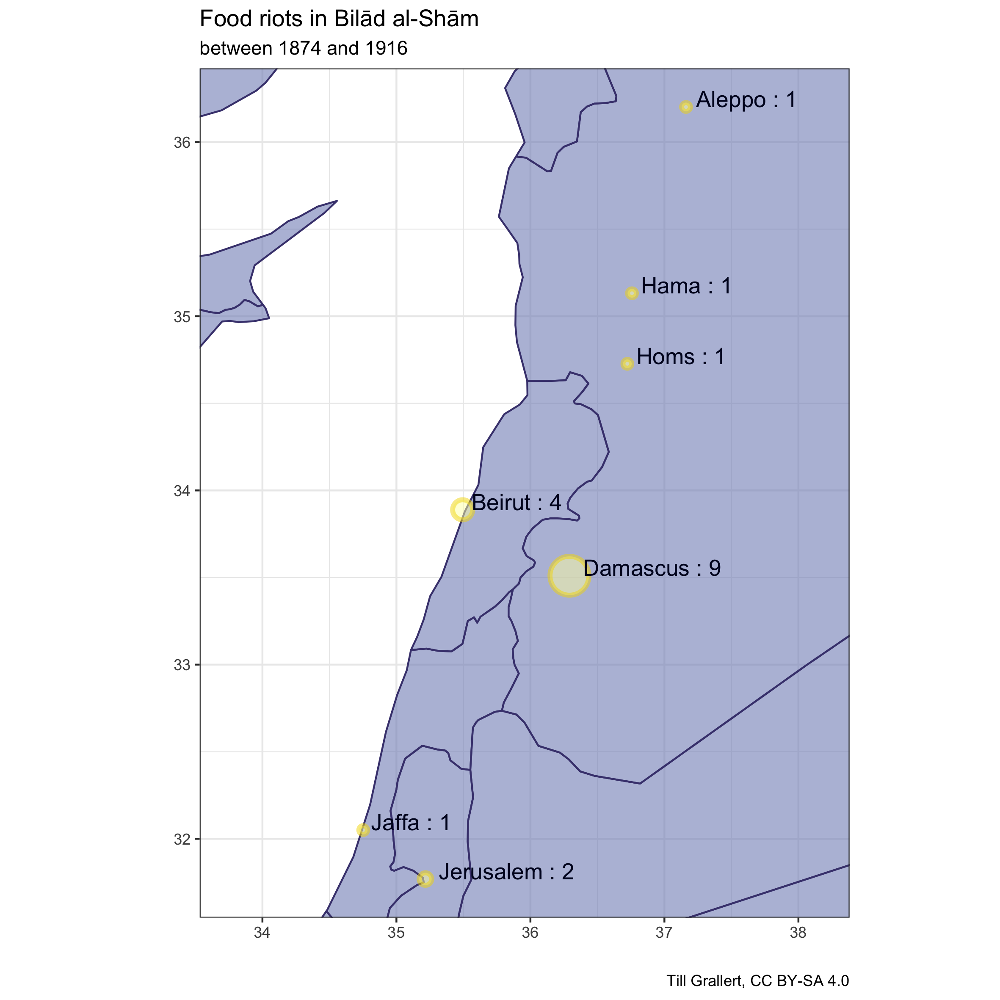
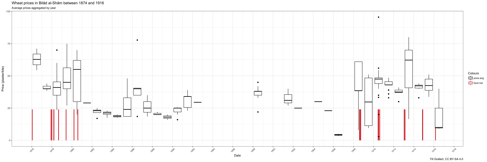
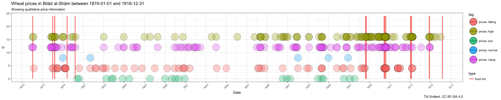
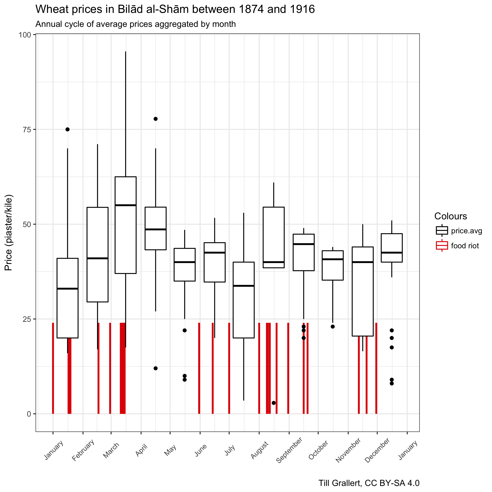

<!-- # processing instructions -->
<!-- ## 1. HTML -->
<!-- pandoc -F pandoc-crossref -s -S -f markdown -t html5 --toc --include-in-header=/BachUni/programming/Pandoc/css-pandoc_online-publication.txt --include-in-header=/BachUni/programming/Pandoc/css-pandoc_code-highlight_oxygen-xml.txt --email-obfuscation=javascript urban-food-riots-in-bilad-al-sham-as-a-repertoire-of-contention.md -o index.html -->
<!-- ## 2. DOCX -->
<!-- pandoc -F pandoc-crossref -s -f markdown+smart -t docx urban-food-riots-in-bilad-al-sham-as-a-repertoire-of-contention.md -o urban-food-riots-in-bilad-al-sham-as-a-repertoire-of-contention.docx -->
    

<!-- ORCID -->

<!-- licence -->

<!-- release -->

<!-- DOI -->

# About {#sec-about}

>This paper is  based on a presentation titled "Women in the streets! Urban food riots in late Ottoman *Bilād al-Shām*", which I delivered at the conference ["The 'Dangerous Classes' in the Middle East and North Africa"](https://www.sant.ox.ac.uk/events/conference-%E2%80%9Cdangerous-classes%E2%80%9D-middle-east-and-north-africa), St. Antony's college, University of Oxford, 26 January 2017. I thank all participants for their valuable comments. All data sets and visualisations are openly available at <https://doi.org/10.5281/zenodo.1008999>

>The current version of this paper after copy editing is [v0.3](https://rawgit.com/tillgrallert/p3601db9e/v0.3/index.html) and contains unprocessed references to sources and secondary literature, cross-references, and CriticMarkup. To comment / review / annotate this version via hypothes.is click [here](https://via.hypothes.is/https://rawgit.com/tillgrallert/p3601db9e/v0.3/index.html). The most recent changes are available [here](https://tillgrallert.github.io/p3601db9e/index.html).

# Introduction {#sec-introduction}

On 21 August 1908, less than four weeks after the restoration of the constitution in the Ottoman Empire, the daily newspaper *Lisān al-Ḥāl* from Beirut published the following article:

> Large crowds of the poor and destitute gathered the morning before yesterday \[19. August\] (*ijtamaʿa \[...\] jumhūr kabīr min al-fuqarāʾ wa arbāb al-ʿayyāl*) in front of the government Serail in Beirut. \[There\] they cried for help, lamented the current situation and called for the prices of flour and bread to be lowered to ease their suffering and that of all the poor; \[...\] most flour merchants and oven and bakery owners tyrannise them and profit from \[the sale of\] sunflower bread in clear breach of all laws and regulations (*jamīʿ al-qawānīn wa al-sharāʾiʿ*) to the extent that a *raṭl*[^2] of bread was sold at more than 7.5 piastres (Ps).[^3] This is unjust (*hadhā mi-mā taʾbāhu* *al-ʿadāla*) and unacceptable.
>
> The protesters grew increasingly vocal until the vigorous Anīs Efendi Ramaḍān, inspector of the police, went out to meet them and soothed their minds with a speech full of courtesy and refinement. He assured the protesters that the authorities were directing their zeal and efforts to the lowering of the prices of foodstuffs and they withdrew gratefully.
>
> Their agreement lasted until they were met by another group of the poor (*jamāʿat min amthālihim arbāb al-ʿayāl wa al-fuqarāʾ*) and joined them on their way to protest at the customs office. They scattered the flour \[found there\] on the floor \[in an attempt to\] prevent its export from the province and chased away everyone who tried to stop them. They only stopped when the director of the police assured them again of the seriousness \[of the government's efforts\] to secure the necessary funds to reduce food prices. He explained it would take less than ten days for the serious flour shortage (*qaḍiyyat al-ṭaḥīn*, "flour calamity"), as well as all other problems they were complaining of, to ease. Thus they were appeased.
>
> Yesterday \[20. August\] the poor gathered again and decided to repeat their demonstrations (*muẓāharāt*) and thus today they roamed wheat stores and all other places where flour is sold. They also protested against the high prices of meat etc.[^4]

Despite the officials' promises and explanations, the "flour calamity" continued: grain prices in Beirut remained high throughout August, at Ps 60 to 62 for a *kile* (bushel)[^5] of best-quality wheat and Ps 35 to 42 for lower-quality wheat from the Hawran.[^6] Some three weeks after the food riot, on the occasion of Sultan ʿAbdülḥamīd II's birthday on 16 Shaʿbān 1326 (15 September), unspecified "poor people" of Beirut approached the governor-general (*vali*) Nāẓim Pasha---already the third person in this post since the August incidents---with a call to rein in the merchants and to adopt sufficient measures against the high prices of flour and bread. The merchants responded by claiming that their suppliers in the neighbouring province of Syria were the ones to blame. Thus, Nāẓim Pasha contented himself with establishing an inquiry and appealing to the merchants to lower prices once the inquiry had come to a conclusion. The last available newspaper report on this matter states that the governor-general is still waiting for an answer from Damascus.[^7]

The incident is puzzling: poor people, suffering from high prices of flour and bread, repeatedly took to the streets in a rather orderly fashion to demand lower prices. They gathered at the seat of the local authorities, complained about greedy merchants, and called for effective price controls. They did not resort to looting despite flour and wheat being readily available in the city. Even when breaking into warehouses (at the customs) they did not seize the food they claimed to be unable to afford. Instead, they scattered it on the floor to prevent its export from the city since they identified exports as one of the main causes of high grain prices. Finally, they failed to achieve any immediate price reduction despite the authorities' promises to the contrary. The main question is thus twofold: why did the protestors opt for this particular form of contentious action even though it proved unsuccessful and why did they not seize the food available in the market?

This paper tries to answer this question by presenting a first analysis of a sample of 19 food riots in Aleppo, Beirut, Damascus, Hama, Homs, Jaffa and Jerusalem at the end of Ottoman rule, between the mid-1870s and 1918 (fig. 1). The phenomenon of food riots in the Middle East preceding the IMF riots of the 1970s and 1980s has not yet received sufficient systematic scholarly attention. This paper represents the first foray in this direction.

{width="6.527777777777778in" height="6.527777777777778in"}

Figure 1: Food riots in Bilād al-Shām, 1874--1916

The first part of this chapter focuses on price data and their potential correlation with food riots. Focussing on wheat prices as the only available measure, we will see only a limited correlation between high food prices and the occurrence of food riots. First, while riots occurred only in times of severely elevated prices, high prices did not necessarily result in riots. Second, food riots had no discernible short-term effect on food prices. The second part presents a comparative analysis of the food riots. Noting the apparent failure of food riots to immediately lower food prices and the relatively rare instances of looting (that also did not commonly target food stores), this paper posits that food riots were neither particularly riotous nor predominantly concerned with food. I argue that the demand for bread had a largely symbolic value and that these contentious performances shared claims and forms to the extent that allows us to speak of a shared and, for the period under study, stable "repertoire of contention" or "a limited set of routines that are learned, shared, and acted out through a relatively deliberate process of choice".[^8] Protestors could resort to this repertoire in negotiations over political legitimacy *within* the existing political order, based on the provision for *just rule* and *safety of life*. Presenting the components of this particular repertoire of contention, I will also show that it was neither particularly Islamic nor informed by a "politics of notables".

This paper employs a systematic reading of five Beiruti and two Damascene newspapers and takes occasional recourse to various other newspapers and journals from Beirut, Cairo, Damascus, Istanbul and Jerusalem between 1875 and 1918.[^9] Almost all detailed accounts of food riots stem from the contemporaneous local news press. The press also regularly carried information on local retail and wholesale prices (see below). The price information was augmented through foreign archival material such as British, American and German consular reports, including the files of the German military and its supply chains in *Bilād al-Shām* during World War I.

Following Charles Tilly's work, I use the term *food riot* to refer to a particular type of contentious collective action: a group of people assembling in a public place and raising the demand for lower food prices vis-à-vis another group of people.[^10] All food riots in our sample conform to this basic definition of a specific *form* of action as well as a specific contentious *claim*. It then follows that food *riots* were not necessarily riotous or violent, nor was their main purpose necessarily the immediate supply with (affordable) *food*. Rather, I argue, *food* and *access to food* at *fair prices* had a symbolic and discursive function: the demand for affordable food gained its power from its inherent legitimacy within any political system based on the minimal consent of the ruled to being ruled. As such food riots were part of the negotiations over political legitimacy *within* the Ottoman political order. I nevertheless retain the terms "bread riot" and "food riot" in tribute to the existing literature on this phenomenon.

Contemporaneous sources did not use a single or specific term to label the events under study. The Arabic denominator for the series of food riots across North Africa and the Middle East in the 1970s and 1980s (IMF riots), namely *intifāḍat al-khubz*, had not yet been coined in the early twentieth century. The common term for reporting food riots in the press was thus the generic "incident" (*ḥāditha*).[^11] When food riots turned violent, witnesses referred to a battle (*maʿraka*), such as the one in Aleppo in 1910,[^12] or even *thawra* (rebellion, revolt)[^13] and *fitna* (strife),[^14] as in Hama and Homs the same year; these were loaded terms that clearly marked the events as illegitimate.[^15] Yet, Beirut's *Lisān al-Ḥāl* acknowledged that the violent food riot and looting in Homs was "a rebellion of empty stomachs" (*thawrat al-buṭūn al-fāghira*).[^16]

My argument is informed by the existing scholarship on food riots in other parts of the world in the wake of E.P. Thompson's seminal work on the "moral economy of the crowd" in eighteenth-century England and Louise Tilly's work on eighteenth-century France. Both Thompson and Tilly agree that food riots, instead of being a spontaneous expression of hunger, were inherently political movements---tactics employed by the lower urban classes to achieve well-defined political aims vis-à-vis a more powerful ruler or ruling class.[^17] They showed how food riots became particularly important during a paradigmatic shift in the political economy of both England and France. They argued that food riots "marked the nationalization and politicization of the problem of subsistence, and \[were\] based on a conscious popular model of how the economy should work".[^18] Faced with the new model of market economy, the crowds called on the authorities to obey the "paternalist model", or the "moral economy of provision" of old, in which market inspectors would supervise direct marketing from the rural producers to the urban consumers and enforce the "just price".[^19] Noting the almost complete failure of food riots to immediately lower prices, Thompson argued that the threat of riots functioned as a general check on bread prices in the long term; in order for the anticipation of riots to trigger relief measures, such anticipation had to be occasionally sustained by actual riots.[^20] The occasion thus became a tactical choice.

Thompson's original contribution led to a sustained debate about the beliefs and imaginations of the protestors and whether the reactionary adherence to a "moral economy" could and should be seen as a conclusive explanation of food riots in general.[^21] A large body of scholarship on food riots in market economies emerged in the wake of the so-called "IMF riots" that took place in most countries of south America, Africa (including every north-African country with the exception of Libya), and south Asia, as well as in Turkey and Iran between 1976--1992 and that further underlined the nature of food riots as inherently political actions. Scholars noted that such riots did not occur in times of extreme scarcity but in reaction to a highly uneven distribution of available food. As such, the argument runs, food riots document an entitlement gap between popular expectations and realisable supply.[^22]

Scholars also tried to explain why the "initiators of the \[early modern\] riots were, very often, the women",[^23] with arguments ranging from their almost natural disposal towards mutiny, to being more involved in face-to-face marketing, to women being regarded as the embodiment of disorder, which in turn caused men to dress up as women in a symbolic performance.[^24] After the disappearance of food riots and the exclusion of women from the emerging public sphere of formal politics, female food riots resurfaced in industrial societies in the twentieth century.[^25]

With regards to the Middle East, crowds, collective action, and popular contentions have become the focus of scholarly scrutiny as well as political and public discourses since the beginning of the ill-labelled Arab Spring in 2011.[^26] Historical studies have mentioned urban food riots in the Middle East in passing,[^27] including some of the riots studied in this chapter.[^28] Yet, the genealogy of popular participation and urban popular contentions in the Middle East remains largely obscure on the empirical as well as the analytical level.[^29] Thirty years ago, Edmund Burke III presented the first foray into a systematic study of collective action in the Middle East over the *longue durée*. He followed the lead of E.P. Thompson and Charles Tilly in abolishing the old cliché of mindless and spontaneous mobs and put forward three broad claims in his attempt to apply Tilly's "repertoire of contention" to historical Middle Eastern societies: first, that the contentious repertoire *remained* Islamic as "movements invariably began in the chief mosque of the city",[^30] where contentious claims were discussed among the crowds before *ʿulamāʾ* emissaries were sent to the rulers for negotiations and before the crowds marched onto the seat of the authorities; second, that the crowds targeted stores and barns; and third, that food riots were absent from the protest forms of the nineteenth century.[^31] All three claims are proven wrong by the case studies presented in this chapter.[^32]

# Food prices and food riots

Reliable historical economic data for Middle Eastern societies is difficult to come by. This is not so much due to a shortage of sources, but the larger academic trend of moving away from quantitative economic micro history, and the tedious nature of the compilation process. Export statistics from various ports in the Eastern Mediterranean can be gleaned from consular reports[^33]; records of the grain exchange in Istanbul are available for scholarly scrutiny; and most newspapers regularly published articles about staple goods and their prices. It seems, however, that only Donald Quataert's seminal thesis on agriculture in Anatolia undertook the task of compiling and publishing detailed time-series on grain prices.[^34] Others either published edited consular sources[^35] or provide only very limited quantitative data.[^36]

It is beyond the scope of this chapter to describe the price sampling methodologies, the resulting sample and our analysis in detail. A short overview must suffice. The time-series of price data were compiled from local newspapers and supplemented with information from American, British, and German archival documents. While newspapers regularly published prices, the frequency of such information varied between locations and over time and is largely unpredictable. Prices were published for different purposes and audiences: lists of wholesale prices were published for the benefit of merchants and without comment; imperial authorities published price lists for tenders to supply the army; local authorities issued threshold prices for basic necessities; and authors included information on prices in their reports from across the region. Therefore, information on wholesale commodity prices and especially grain prices is more frequently available for the port city of Beirut than for the inland cities of Damascus or Jerusalem. Lists of wholesale prices the authorities were willing to pay are more commonly available for Damascus, the seat of an imperial Army Corps. Finally, journalists and local authorities tended to focus on prices only when they deviated from the long-term trend, leading to more data points on inflated prices. The only meaningful time-series with sufficient data to actually analyse long-term developments thus compiled are the prices of a bushel (*kile*) of wheat (fig. 2).[^37] This set of qualitative price information can be further complemented and validated by qualitative statements on the prices of foodstuffs and changes thereof, which were also frequently published in the press (fig. 3).

Relying predominantly on wholesale prices of wheat for evaluating the relation between changes in food prices and the occurrence of food riots is a fruitful endeavour because of the particularities of the food economy in *Bilād al-Shām*. First, although information on consumption is scarce, a sketch of the general pattern is possible. The majority of townspeople was poor and lived mainly on vegetarian provisions, with cereals as their main source of nutrition. They preferred white bread made from wheat---a rule from which they diverted only in times of want, when brown and even black bread became the only options. In accordance with European patterns, the demand for bread, which accounted for half of people's normal diet (c. 1/4 *raṭl* per day), was highly inelastic (i.e. unresponsive to a change in price) and would even reach 90 per cent in times of want (because all available funds would be spent on bread).[^38] Second, complaints about expensive or unaffordable bread commonly provided wholesale wheat prices, thus linking the two. Third, the relation between a volume of wheat and a weight of bread does not change considerably, save for changes in the recipe. Fourth, the vast majority of townspeople had neither an oven nor the means to buy large quantities of grain immediately after the harvest when prices were low and to safely store them for several months. Thus, they relied on the local neighbourhood ovens-cum-bakeries for their daily bread.[^39] In this regard it does not matter whether bakeries operated independently from millers and wholesale grain merchants or not: the townspeople were completely dependent on the availability and constant supply of *sufficient* amounts of bread and therefore grain at *affordable* prices in a money-based market economy.

{width="6.527777777777778in" height="2.1759251968503937in"}

Figure 2: Wheat prices in Bilād al-Shām, 1874--1916[^40]

{width="6.527777777777778in" height="1.3055555555555556in"}

Figure 3: Qualitative information on prices of food stuffs, 1874--1916[^41]

{width="6.527777777777778in" height="6.527777777777778in"}

Figure 4: Annual cycle of wheat prices in Bilād al-Shām, 1874--1916

Fig. 2 shows the highly uneven distribution and fluctuation of wholesale wheat prices and food riots in *Bilād al-Shām* between the mid-1870s and the end of 1916 (when, due to World War I, prices skyrocketed to an extent that would distort the plot). Prices fluctuated widely year-on-year, in addition to the annual cycle of rising prices during the spring, before new harvest reached the market in June (fig. 4). In years of abundant harvests, such as 1882, 1884, 1905 or 1906, prices would fall below the long-term average of Ps 20 to 25 per *kile*[^42] to Ps 17 and even Ps 14. When calamities such as locusts and insufficient winter rains threatened failing harvests, prices reached Ps 60 per *kile* and more. This data does not mirror the trend of falling grain prices between 1876 and 1905 followed by a sharp increase of some 25 per cent between 1906 and 1908, observed by Donald Quataert in Anatolia. Since the 1876--1905 decrease was partially due to American wheat flooding the world markets, it is not surprising that it cannot be observed in Bilād al-Shām, which relied on local crops. While average grain prices in Istanbul fell from c. Ps 25"20 per *kile* to Ps 18"20, Ps 25 was considered the normal price in Damascus in good years.[^43] The inflation and fluctuation of exchange rates between the gold lira and the silver piaster are of no importance in this context since prices were always quoted in piastres only.[^44]

The comparison of the time-series of wheat prices across *Bilād al-Shām* with the temporal distribution of food riots (marked by vertical red lines in the plots) allows for two observations. On the one hand, we see only limited and certainly no simple causal relations between high food prices and the occurrence of food riots. Food riots coincided with periods of elevated food prices as measured in wholesale prices of wheat. But this cannot be said of the opposite---high food prices did not necessary result in food riots. Thus, while high food prices coincided with food riots in the late 1870s, in 1908 and 1910, extensive archival research has not brought up any report on food riots in 1891 or 1898.[^45] The broader context of the Ottoman Empire may help explain this. During the late 1870s and from 1909 onwards, the empire's institutions were weakened by wars, resulting in increased conscription among the poor and thus a prolonged absence of men from *Bilād al-Shām*, state bankruptcy in 1876, the introduction of paper currency (*kaime*) subject to high inflation rates, and the state's inability to pay salaries in conjunction with forced subscriptions among officials to finance the war effort. In addition, during both periods the empire underwent rapid political transformations: the proclamation of the constitution in 1876 and its restoration in 1908 were both framed by revolutionary discourses of general equality and liberty. Further research on food riots during other historical periods is necessary to substantiate this argument but the concurrence of these major crises and food riots seems a promising track to follow.

There were, of course, local factors that contributed to the decision on whether to engage in a food riot or not. The summer of 1910, which saw a series of food riots in Aleppo, Damascus, Hama, and Homs (see below), is a case in point. In all four cities, newspapers reported high prices, the suffering of the poor, and criticized hoarding merchants and adulterated bread as well as idle authorities. Similar reports were coming from Beirut, but despite bread prices reaching the same threshold of Ps 7\"20 as in August 1908 (see above),[^46] this time there was no food riot. This absence even served as an argument against the ban of flour exports from Beirut to Damascus at the time: the province of Syria argued that orders to send all available flour to Damascus should be upheld since there had been no food riot in Beirut and thus it could not possibly be worse off than Damascus.[^47]

On the other hand, the comparison of prices with the occurrence of food riots reveals the inherent failure of these contentious performances in bringing about lower food prices in the short term. We will return to this point in the next section of this chapter.

# The repertoire of the food riot

If food prices cannot explain the timing of food riots and if food riots have no discernible short-term effect on food prices, one has to look at the specific events for the reasons why protestors opted for this specific contentious form and claim and why they did so at these particular times. The sample of 19 food riots in Aleppo, Beirut, Damascus, Hama, Homs, Jaffa and Jerusalem share enough structural characteristics and the reports thereon display enough narrative commonalities to argue that the "food riot" was indeed a "repertoire of contention". Charles Tilly's idea of a repertoire as learned and of shared routines as readily available contentious performances, can help us make sense of the protestors' seemingly paradoxical choices. They protested in times of destitution, expending calories without being able to eat sufficiently; they protested despite the threat of violent repercussion; and complaining about hoarding merchants, the protestors addressed authorities with the demand to enforce threshold prices despite the authorities' apparent inability to prevent such protest or to enforce such prices.

The repertoire of the food riot in late Ottoman *Bilād al-Shām* can be broken down into a sequence of events that occurred in three phases: a prologue of artificially high prices and "inspiring" events conducive to popular protest; the food riot itself that never lasted through the night but could be repeated over some days, and which rarely involved the looting of foodstuffs; and the immediate aftermath of not more than a month during which the authorities tried to contain the anger through (largely symbolic) investigations and administrative measures.

## The prologue

All food riots were preceded by extended periods of hardship and elevated food prices during which a discourse on *artificially* high prices surfaced in the written sources. The timing of the contentious collective action itself then depended on local circumstances.

### 1. Artificially high prices

Prohibitive prices of bread and grain were commonly portrayed as artificially high and blamed on greedy wholesale merchants seeking undue profits from either exporting or hoarding cereals and thus draining the local market. In the case of Damascus and Beirut, exports were usually destined for foreign markets, but in inland towns, such as Hama and Homs, Damascus as the provincial capital was the main export destination deemed responsible for the price hikes.

At the time of increased and rising prices, some (unnamed) people would begin to criticise (*shakā*) those responsible as evil-doing hoarders and monopolists (*muḥtakirūn*).[^48] Newspapers went to some lengths to emphasise the sinister machinations of the grain merchants, addressing them as the "lords of greed" (*arbāb al-maṭāmiʿ*)[^49] conspiring to form monopolies (*istaʾthara*[^50]) and cartels (*iʿtaṣaba*[^51]). When reporting on the riots, many sources emphasise that criticism of the merchants' illegal actions had been raised before anything of a violent nature happened and through established channels, such as a petition.[^52]

Thus for example in the summer of 1910, Aleppo suffered from extremely high prices of wheat in early June and hoarding merchants were blamed for the calamity. When the price of wheat fell from a height of Ps 57-64 per *kile* to Ps 27-30, some merchants began to buy up all the grain in the market in order to push prices up again. Newspapers singled out ʿAbd al-Raḥmān Efendi Jāsir, a merchant who still held a large quantity of wheat from the previous year's harvest, for having caused an increase to Ps 40 per *kile* with this tactic.[^53]

Prices were also high and grain was all but unavailable to the poor in Hama and Homs during the summer of 1910 due to a cartel (*iʿtiṣāb*) of grain merchants hoarding and exporting cereals to more profitable locations. In Hama, all available reports[^54] blamed greedy wholesale merchants and their attempts to profit from the unrest in the Hawran and the resulting high grain prices in Damascus by exporting all available cereals to the provincial capital. Some if not all grain merchants in Homs closed their stores, arguing that they could not afford to sell at the price imposed by the authorities.[^55] Two weeks before the food riot in Homs on 13 August, the common people (*al-ʿāmma*) had addressed a petition to the authorities, explaining their suffering from obscene prices of grain and calling on the officials to intervene and show consideration for the poor. But the government did not find a means to satisfy their demands, despite ample wheat being available in the granaries.[^56]

### 2. An advantageous moment

Once the stage was set and merchants' responsibility for the suffering of the poor was established, protestors seemingly had to make a tactical decision as to the timing of the contentious collective action: one that would ensure high visibility of the protest, draw larger crowds of protestors, avoid violent retribution, and cause maximum embarrassment to the authorities. People usually took to the streets on Fridays, when towns were crowded with worshippers and shoppers; in close temporal proximity to religious and state holidays, when towns were the stage for large, state-sponsored and affirmative public rituals that displayed a model *of* and *for* society based on the circle of justice and good governance[^57]; and after changes in administrative personnel, when a new governor (*mutaṣarrif*) or governor-general (*vali*) were less likely to be able to rely on local networks of support or command the full loyalty of the local garrison.

Thus, the Beirut food riot of August 1908 took place at a time of political turmoil. The Young Turks had just staged their coup and reinstated the constitution of 1876. Their followers and the Committee of Union and Progress (CUP) tried to quickly seize power on all levels of the state administration and across the whole empire, bringing a quick succession of appointments and dismissals of officials and large-scale public celebrations. When protestors took to the streets on 19 August, Beirut had seen daily popular celebrations and the second governor-general in the course of a month had already submitted his resignation[^58]. By the time the poor raised the matter of high food prices again, on the occasion of the Sultan's birthday on 15 Shaʿbān 1326 aH (15 September), at least two other people had been appointed to the post.[^59]

In March 1878 Cevdet Pasha, the governor-general of Syria, was new to Damascus and all but one battalion of the 5th Army were absent from the city, fighting in the Russo-Ottoman War. Upon the public reading of his *firmān* of appointment on 8 March, he announced the beginning of an era of the rule of law and just government.[^60] Food riots began on 12 March and continued to intensify until their culmination on 16 March, which happened to be the day of *mawlid nawbawī* (the Prophet's birthday), on 12 Rabīʿ I 1295 aH. 32 years later, another food riot took place in Damascus one day before *mawlid nabawī* 1331 aH, on 17 February 1913.[^61]

Similar arguments can be made about the 1910 food riots in Aleppo, Damascus, Hama, and Homs. Protestors pushed their negotiating power by exercising their constitutional rights to assemble and protest and by employing the new symbolic repertoire of popular rallies and demonstrations---commonly staged in support of the authorities and against foreign enemies[^62]---against the authorities themselves in close temporal proximity to official celebrations of the second anniversary of the restoration of the constitution on 24 July (the food riots took place in mid-June in Aleppo, on 2 July in Damascus, on 11 August in Hama and two days later in Homs). In addition to this larger context, a new director of police, Nāfidh Efendi, had arrived in Damascus the day before the demonstration, while the entire municipal council had stepped down on 15 June over a fiscal scandal surrounding the project to supply the city with water from ʿAyn Fīja.[^63]

## The food riot itself

The actual food riot was a bounded event commonly lasting only a few hours. It could be repeated on successive days or within a week's time but it never continued through the night. Its main characteristics were that a) large crowds of protestors targeted the authorities in a mostly peaceful manner, calling for the enforcement of *fair* prices (*asʿār muʿatadila*, *taʿdīl al-asʿār*) and b) in the rare cases when violent looting took place, the crowds predominantly targeted non-food items.

Good examples of the above sequence of events include the food riot in Beirut in 1908, outlined at the beginning of this paper, and the food riots in Damascus, Hama, and Homs in 1910. It is worthwhile to look at them in some detail. On the morning of 2 July 1910 criers roamed the streets of Damascus, calling on the people to join a demonstration against high bread prices at Marja Square and in front of the New Serail.[^64] Within an hour, the streets were packed with people marching towards Marja Square. The crowds were headed by a vanguard of women howling and shouting their disgust about the authorities' failure to provide bread at fair prices.[^65] The marchers united at Marja Square, where women, many of them carrying children and infants, took the lead again and noisily demonstrated under the windows of the New Serail, which was located off Marja Square on the banks of the Barada river.[^66] Officials in the various offices around the square became wary and called on the 5^th^ Army, headquartered in the city, to send in troops for their protection. The army complied and imperial troops dispersed the demonstrators with threats of violence, beating, and by sloshing them with water from fire engines. The agitated crowds scattered through the city in search of grain traders, all the while chanting insults and abuse of hoarders, calling on God to deliver them from the tyranny of the monopolists.[^67] Yet no looting seemed to have followed the incident. By the evening, the city was quiet again and the governor-general, Ismāʿīl Fāḍil Pasha,[^68] delivered a talk on his recent journey to the southern districts of Kerak and the Hawran at the local CUP branch.[^69]

A month later, in Hama, a demonstration against high bread prices escalated into a violent food riot on Thursday 11 August 1910.[^70] That day, a large crowd of poor men, women, and children marched to governor Nāẓim Bey's Serail of the on the eastern banks of the Orontes river.[^71] There they demonstrated peacefully against the merchants' high profits from the trade of foodstuffs and against all exports to Damascus. Nāẓim Bey directed the crowd's anger to the municipality (*belediye*) at the opposite, Western, end of the street leading to the Serail. He called upon the *belediye* to enforce sufficient price control measures. However, the governor and the municipality could not agree upon their respective responsibilities; dissatisfied by the official response, the crowds dispersed and began to attack stores in three different locations.

At first, the protestors tried to enter al-Mashnūq's store. When they failed to break into the warehouse, they resorted to throwing stones. They then turned onto Maḥmūd al-Farrā, the merchant whom they identified as the main culprit behind their misery. They located al-Farrā at the slaughterhouse and threatened him with murder. He managed to lock himself inside and later escaped.

The crowd then split in two. One group went to the railway station to the south-west of the city, where large quantities of grain destined for export to Damascus were stored. The protestors forced the gates of some of the surrounding warehouses open and looted some 600 bags of grain without touching any of the railway carriages full of wheat that were waiting on a siding. The stationmaster, a certain Nabīh Efendi, apparently managed to convince the crowd that the station, its stores of lentils and onions, and all coaches were property of the state and that the Ḥijāz Railway as such was a pious Muslim endeavour and therefore should be protected from their wrath---He also allegedly managed to take the photo of the protestors with their loot that was later used for identification. After successfully seizing the grain, the crowds broke into one of al-Farrā's warehouses at the station. It turned out to hold skins and empty bags, which they looted. According to *al-Muqtabas*, the crowds then began shouting: "By God, onto al-Bārūdī, onto al-Bārūdī".

At the western square, they looted the stores of Aḥmad al-Ṣamṣām, Ibn al-Habiyān and al-Bārūdī and took all the rice, sugar, and coffee they could find. Finally, they looted Aswad and Sharrāḥ's warehouse in the al-Jisr quarter and took all the grain stored inside.

The crowds roamed the streets for two and a half hours without any intervention by the authorities and were finally dispersed by a small detachment of motorised imperial troops (15 men). *Al-Muqtabas* mentioned the honourable but futile attempt of a single mounted policeman, a certain Khudr Efendi, to disperse the crowd. The newspaper also polemically mocked the commander of the gendarmerie as having said in Ottoman Turkish "My dear, what can we do?" (*canım ne yapalım*) upon his arrival at the scene, after which he retreated with his men.[^72]

Two days later, on the morning of Saturday 13 August 1910, an agitated crowd comprising thousands of poor and destitute people---"among them old and young, the shaykh, the young, the woman, and the infant"[^73]---gathered in the Suqs in the eastern part of Homs and then moved northwards in the direction of the Serail and the *belediye*.[^74] They gathered without weapons but---some claimed---with the intent to loot and plunder the grain stores. Aḥmad Kurd ʿAlī, the brother of Muḥammad Kurd ʿAlī and co-editor of his newspaper *al-Muqtabas*, was on a journey to the north and quickly travelled to the location of the incident, from where he filed a number of lengthy reports. According to him, the food riot began with a certain Yūsuf ʿAbyān who

> wanted to buy flour in the quarter of Bāb Tadmur to the east of Homs. But what he wanted could not be obtained because the city had been devoid of this item according to some papers. The man took off his shoes, put both of them on a stick, and began to run and yell: 'oh poor, I am your father. I sacrificed my life for your sake' (*ayyuhā al-fuqarāʾ fa-ana abūkum afādī bi-ḥayātī fī sabīlikim*).[^75]

Despite numerous long reports in the press, the sequence of events that followed is not entirely clear. However, demonstrations and looting occurred in at least four different locations: the square in front of the Serail, the warehouses near the municipal garden, the Tripoli-Homs coach station, and the railway station on the Damascus-Hama line.[^76]

Reports agree that the first confrontation between the protestors and the authorities took place in front of the Serail.[^77] According to *al-Ittiḥād al-ʿUthmānī*'s final report on the incident, the crowds marched through the streets and directly onto the Serail, "shouting slogans, swearing and cursing (*maʿnāhu al-sibb wa-l-shatm*) everybody not marching with them".[^78] There they held a demonstration and called on the authorities to rein in the merchants and prevent them from exporting grain from the city. They were confronted by the *ḳaymaḳam*, ʿAtā Allah Bey al-Ayyūbī, accompanied by three or four gendarmes and policemen.[^79] He delivered a speech, threatening, pleading, cautioning, and promising to decrease the price to Ps 3 for a *raṭl* of flour.[^80] According to Aḥmad Kurd ʿAlī, the crowds rejoiced at the *ḳaymaḳam*'s announcements and would have left, had it not been for some riff-raff among them.[^81] A certain T.ʿM. reported in *al-Ittiḥād al-ʿUthmānī* how some of the nobles and officials began to disperse the crowds after the *ḳaymaḳam*'s speech. This initiated a skirmish during which the demonstrators started to throw stones, realised their strength and then began to attack warehouses.[^82] However the violent confrontation might have begun, the *ḳaymaḳam* gathered all the gendarmes he could muster---about ten men---and ordered them to shoot into the air to disperse the protestors. Many of the protestors fled then but at least three groups remained: one went on to loot warehouses in town, one engaged the gendarmerie at the coach road station, and the third attacked the railway station.[^83] Meanwhile the *ḳaymaḳam* requested reinforcements from Hama and Damascus.

The first group of looters targeted the stores of Muṣṭafā ʿAbbās, Najīb Laṭīf, and Muṣṭafā Efendi Arslān, all in the vicinity of the municipal gardens adjacent to the Serail.[^84]

The second group went to the Tripoli-Homs coach station and attempted to break into the warehouses there.[^85] They encountered the gendarme Tawfīq Efendi al-Atāsī, attacked him with stones and wounded him on the forehead. The *ḳaymaḳam* arrived with three gendarmes, but they were also met with showers of stones and he had to retreat to the Serail with the gendarmerie commander. From there they tried to rescue al-Atāsī again by threatening to use firearms. This stopped the crowd and the protestors dispersed.[^86]

The third group went to the railway station in the south-west of the city,[^87] where they began looting some 16 wagons [^88] filled with grain, fat and manufactured goods from Hama and Homs, all destined for export. When three gendarmes and some volunteers---the already wounded Tawfīq Efendi al-Atāsī, Badawī Efendi al-Sibāʿī, Aḥmad al-Sibāʿī and the municipal bailiff (*jāwīsh*) Ahīn Ibn Diyāb---arrived at the scene, the looters abandoned the wagons and went to the warehouses in search of grain. A vanguard of the protestors had already forced their way into the stores located near the station and looted the Khān al-Salmūniyīn, Khān Bayt al-Ṭayf, Makhzan Bayt Baḍrīṭa, Makhzan Bayt Ṭalīmāt, Makhzan Farkūḥ, and a number of other warehouses not identified by name.[^89] According to one report, the crowd insulted the gendarmes during the altercation and gave them a severe beating (again). At some point the gendarmes even had to surrender their arms, although they were later returned.[^90] In another version of the story, the station officials defended themselves by the same means as the protestors, i.e. by throwing stones at the looters. A Circassian called Idrīs drove his horse into the crowd in order to relieve the defenders, but he was repelled with showers of stones.[^91]

Looting and violent attacks continued sporadically into the evening, with groups of agitated people roaming the streets and inciting speeches delivered across the town. The crowds only dispersed after dark.[^92]

The narratives about these incidents are fascinating and deserve a study of their own---what, for instance, is the political agenda behind *al-Muqtabas*' mocking polemic of the gendarmerie commander in Hama, providing a most probably unsubstantiated quote in Ottoman only? However, here we are concerned with food riots as contentious performances and with establishing a set of features that are common to most, if not all.

### 3. The formation of a crowd

Food riots invariably commenced with the gathering of a crowd of townspeople---usually described as consisting of the poor. Sometimes authors emphasise the inclusive character of the crowd by mentioning men, women, and children, old and young, etc. At least in Damascus, women were portrayed as leading the crowds or even as constituting the majority of participants. Unfortunately the identities of protestors cannot be established beyond such generic descriptions. The only exception is the above-mentioned Yūsuf ʿAbyān from Homs.

The terms used to label the crowds of protestors were mostly derivatives of the roots *j-m-ʿ* and *j-m-h-r*, i.e. *tajamhara*[^93], *ijtamaʿa*[^94], *tajammaʿ*[^95] and *jamʿ* / *jumūʿ*[^96] and *jumhūr*[^97] / *jamāhīr*.[^98] As such, they do not carry a moral judgement. Reports commonly emphasised the needy state of the protestors. Thus, we are informed about the gathering of "a large crowd of the poor" (*jamm ghafīr min al-fuqarāʾ*)[^99] and "crowds of poor inhabitants" (*jumūʿ al-fuqarāʾ min al-ahālī*)[^100]. The presence of women further underlined the neediness of the protestors: in Damascus "a crowd of poor women gathered" (*ijtamaʿa jamīʿ al-fuqarāʾ min al-nisāʾ*)[^101] in March 1878; also in Damascus, "crowds of women banded together \[...\] in front of the Serail" (*kaththarat jumūʿ al-nisāʾ*)[^102] some thirty-two years later, in July 1910, "carrying small boys and infant girls in their arms"[^103] "until the streets were congested; women leading and the men behind them as the main force" (*ḥatā ghaṣṣat al-shawāriʿ wa-l-nisāʾ fī al-muqaddima wa al-rijāl min warāʾihin ka-quwwat al-ẓahr*)[^104]; and in February 1916, "the town hall was packed with poor women" (*izduḥimat ams dār al-baladiyya bi-l-faqīrāt al-nisāʾ*)[^105]; in Aleppo, "poor Muslims, women and men, gathered together" (*tajamhara* \[...\] *fuqarāʾ al-muslimīn nisāʾan wa-rijālan*)[^106] in June 1910; ʿUmar Ṣāfī reported from Homs two months later that those looting the grain stores were unarmed since the crowd was made of "the poor, women, and children".[^107] This pattern of explicitly stating the all-encompassing character of the protest was not limited to food riots; a report on the Algerian refugees' protest in front of the Serail in Beirut in January 1910 read: *tajammaʿ ʿadad wāfir bayn rijāl wa-nisāʾ wa-awlād min al-muhājirīn al-jazāʾirīn al-fuqarāʾ*.[^108]

The gathered people were described in neutral terms---such as *al-qawm* (groups of people)[^109], *al-ʿāmma* (the commoners)[^110] or *al-shaʿb* (the populace)[^111]---unless the food riot turned violent. Then the reports immediately switched to terms denouncing the crowds' actions as illicit. Violent protestors were portrayed as rebels (*thāʾirūn*[^112] or *thuwwār*[^113]) and the crowds were denounced as a mob of riff-raff (*al-raʿāʿ*[^114] and *al-ghawghāʾ*[^115]).

### 4. Peaceful demonstration

In most cases the crowd gathered at or marched onto the seat of the local government, be it the municipality, or the seat of the district or provincial authorities. There they peacefully raised their complaints about hoarding merchants and their demands for the authorities' intervention to ensure affordable bread and grain, namely the enforcement of a *just price*. What sets food riots apart from other forms of contentious performance, such as soldiers' mutiny or inter-communal violence, is that the protestors took recourse neither to an Islamicate repertoire nor to the "politics of notables". We do not have a single report of crowds assembling at a central mosque or of notables acting as intermediaries between the populace and the ruling authorities.[^116] The importance of the latter point cannot be overstated. In the wake of Hourani's seminal article, the importance of a class of local intermediaries---commonly referred to as *ʿayān*---for the governance of *Bilād al-Shām* and the Ottoman *ancien régime* has become a given in scholarly literature.[^117] The extent of this phenomenon is such that that Dana Sajdi lamented the prevalence of "ʿayān-ology" among scholars of the modern Arabic-speaking provinces of the Ottoman Empire in the eastern Mediterranean, even though they lacked an "agreement on how this category is constituted."[^118]

### 5. Dissolution of the crowd or escalation into a riot

Once the protestors made their complaints to the authorities, representatives of the state attempted to appease the gathered crowds. They acknowledged and affirmed the inherent legitimacy and justness of the people's demands and tried to dissolve the potentially dangerous gathering through a combination of promises, threats and violence. In some cases, the crowds gathered not in front of the highest political authority, but at the most prominent square in town, which could be near the *belediye* or the *ḳaymaḳam*'s office*.* In those instances, the lower officials tried to redirect the crowd's anger to the higher authority---the governor or governor-general.

The authorities' initial reaction was the decisive factor in determining whether a peaceful demonstration turned into a violent riot and looting. If they failed to dissolve the crowd, the agitated demonstrators began roaming the streets to search for other targets. It seems as if the original threat of violence had to be backed up by real violence if the authorities showed contempt for the protestors.

### 6. (optional) Rioting and looting

The crowds finally turned against the merchant class, identified by both the protestors and the authorities as responsible for the general calamity. Groups of people violently looted warehouses and stores. They targeted warehouses at railway and coach stations in particular, as they were part of the vilified export trade. However, in all but one case, when the grain stores at the Homs railway station were looted, the looters targeted anything but food and thus seem to have been bent on inflicting harm on their oppressors rather than satisfying their demand for food. The local authorities, already tainted by their earlier failure, were often portrayed as utterly helpless and incompetent during the violent part of the collective action.

### 7. Successful intervention of the highest representative of the central authorities

Peace and tranquillity as the defining basis of Ottoman political legitimacy---*asāyiş-i ʿumūmī* or *al-rāḥa al-ʿumūmiyya*---were finally re-established by the intervention of the highest representative of the central authorities, namely the governor or governor-general, and with the help of imperial troops or the gendarmerie.

## The aftermath

The aftermath of a food riot commonly saw two diametrically opposed developments. On the one hand, the press published long eulogies for the central authorities, represented by the governor-general, for punishing the hoarders and for enforcing fair maximum prices. On the other hand, no factual reports of falling food prices can be found.

### 8. Official investigation

After violence had been quelled or after the peaceful demonstration had been dissolved, the highest representative of the central authorities commonly engaged in a flurry of activities demonstrating the empire's energetic intervention to restore justice. Committees were set up to investigate the (pre-established) cause for high prices, namely the hoarding merchants; exports of grain were (again) banned; wholesale merchants were reprimanded for the artificial price hikes; some grain was confiscated from the hoarding merchants (but not re-distributed); and official maximum prices for grain, flour and bread were again published by the municipalities. Only in a single instance, when the protestors looted grain stores in Homs in 1910, did the authorities prosecute them. Otherwise, protestors went unpunished (but not necessarily unhurt), which was both an affirmation of the protest's legitimacy (in form and content) and a tacit acknowledgement of the impossibility of effective law enforcement.

The events of 1910 shall again serve as an example. For a number of days after the riots in Aleppo in June, soldiers patrolled the al-Jalūm quarter to preserve safety and public order. The authorities arrested ʿAbd al-Raḥmān Efendi Jāsir, the merchant deemed responsible for the price increase, seized his grain and sold some of it in a public auction. The governor-general counselled all other grain merchants to immediately sell a large quantity of wheat. In addition, he prohibited the export of grain from the province.[^119]

Two weeks later in Damascus, the governor-general invited the leading notables and dignitaries of the city, the *imām*s of the quarters and their *mukhtār*s for separate meetings at the Serail on 3 July, and severely reprimanded them over the previous day's demonstrations. He explained that while the people had a legal right to gather and petition the authorities, the events were outright illegal as they inflicted harm upon the homeland. As the notables and heads of the land (*bilād*) they had the duty to counsel the people in comprehensible language that such actions were not advisable.[^120] In addition, provincial authorities wrote to the districts of Hama and the Hawran, as well as the neighbouring province of Beirut, imploring them to send whatever supplies of wheat they had to Damascus. In Damascus itself, the municipality set the maximum price for a *raṭl* bread of good quality at Ps 3\"30 and took unspecified measures against the merchants suspected of hoarding.[^121] One week after the food riot, *al-Bashīr* reported that the provincial administrative council had investigated the high prices of wheat and come to the conclusion that hoarding merchants were the sole culprits. Consequently, the council banned this practice.[^122]

In the aftermath of the food riot in Hama on 11 August 1910 (called *ḥādithat Ḥamā*[^123] and *fitna*[^124]), the authorities set up an investigative committee to establish the reasons behind the price hikes and identify the looters. Both the governor of Hama and the governor-general of Syria issued orders against inflated prices and banned exports from Syria. But while the press called for the punishment of all monopolists, reports on falling prices are nowhere to be found.

In Homs, the *ḳaymaḳam* and the small number of gendarmes under his command began conducting door-to-door searches for looted goods after an uneasy but quiet night on 14 August 1910. Those found in possession of stolen wheat were arrested. At noon, an official investigation was set up with the participation of the gendarmerie, the province's public prosecutor, who had arrived from Damascus for this purpose, and the local authorities.[^125] In the evening a company (*bölük*) of imperial troops arrived from Damascus as a reinforcement to prevent further rioting and to help recover the loot.[^126]

That night the looters tried to get rid of the stolen grain in anticipation of retribution. Some buried it in their homes, some hid it underneath legitimate grain, but many threw the cereals into the streets, the moat of the citadel and into sewers.[^127] The following day, the *ḳaymaḳam* and the *ḳaẓa*'s public prosecutor continued the door-to-door searches and arrests. Within a week about 100 people were sentenced but only 49 were arrested for their participation in the looting (i.e. more than half of those sentenced were never apprehended).[^128] The recovered foodstuffs were brought to the Serail.[^129] The merchants gathered and called upon the authorities to either surrender the confiscated grain or pay the official price, as was their right under the law.[^130]

Finally, the local authorities tried to enforce lower prices. Municipal criers walked the streets of Homs under orders of the head of the *belediye*, Muḥiyī al-Dīn Efendi Shams al-Dīn, announcing the prohibition of grain exports to destinations outside the province. They stated that those found guilty of breaching these orders would be punished and their grain would be seized.[^131]

### 9. No reports on falling grain prices

Ultimately, despite all the praise of successful interventions by the central authorities, food prices did not fall in any significant way in the immediate aftermath of food riots. In many instances, they even continued to rise until the arrival of new harvests caused the usual cyclical decrease.

According to a generic note in *al-Bashīr*, the measures undertaken by the authorities in Aleppo were successful and the price of grain fell[^132] but in early July 1910 a *kile* of wheat was still sold at Ps 64[^133]---same as the maximum price at the onset of the events. In mid-August Aḥmad Kurd ʿAlī reported from Aleppo that false rumours of locusts destroying the harvests were used to justify the continually high prices. He complained that a *kile* of wheat still cost Ps 30 to 39.[^134]

In Damascus, the price of wheat fell to Ps 53 per *kile*[^135] on 2 July 1910, the day of the riot. Two months later prices had hardly improved. The *belediye* convened a meeting of bakers and millers on 29 August and announced new maximum prices: Ps 40 to Ps 57 for a *wazna* of flour, and Ps 3 to Ps 3"35 for a *raṭl* of bread, depending on the quality[^136]---which is almost the same price as the Ps 3"30 for a *raṭl* of good bread imposed on the day of the riot.

Two weeks after the food riot in Damascus, on 17 February 1913, *al-Muqtabas* reported a 30 per cent drop in the price of a *wazna* of flour from Ps 6"20 to Ps 4"20.[^137] A day later, on 3 March, the *belediye* set a new maximum price for a *raṭl* of bread at Ps 4.[^138] However, on 6 March, *al-Muqtabas* stated that against all hopes the price of grain had not fallen.[^139] The MP for Damascus, Shukrī al-ʿAsalī, lobbied for easing the price of wheat through lifting all import customs for the duration of two months[^140] but at the end of March, wheat was still sold at Ps 59 to 65 per *kile* because up to three quarters of all millers did not adhere to the prices established by the *belediye*. Therefore a meeting of millers and flour merchants was convened at the municipality on 30 March;[^141] the merchants claimed they could not possibly buy wheat at lower prices and that they would have to sell at even higher prices in consequence.[^142] A week later, prices reached up to Ps 80 per *kile* of wheat.[^143]

# Conclusion

This paper presented the first systematic attempt to study food riots in *Bilād al-Shām* during the final decades of Ottoman rule. A brief foray into a time-series of wheat prices across the entire region showed the limited explanatory power of food prices for the occurrence of food riots. On the one hand, periods of high food prices did not necessarily result in food riots and on the other, food riots were never successful in bringing about lower food prices. I then turned to micro studies of individual food riots and put forward the observation of significant structural similarities among them that can be broken down into three different phases and a sequence of bounded events common to (almost) all food riots.

I argued that such a shared and learned repertoire can serve to answer the question why protestors did engage in food riots even though they constantly proved unsuccessful in achieving their stated goal, and why the protestors did not usually seize food by force. The demand for bread at *affordable* and *established* prices was largely symbolic---as attested by the constant failure of the protest in securing this demand---and part of the larger negotiation of political legitimacy in times of internal and external crisis. In line with the "moral economy" of English and French crowds in the seventeenth century, protestors called on the rulers to obey the *ancien régime* of paternalist obligations towards the ruled. The demand for bread was chosen because it was (and is) inherently legitimate. The protests were accompanied by a discourse on greedy merchants who were ultimately to blame either for the enforcement of an *unfair* market economy, governed by the forces of supply and demand, or for sabotaging the fair negotiation of prices through the formation of cartels and hoarding. The protestors offered the authorities a way forward: rein in the merchants, re-establish your authority over public affairs, and win our continued loyalty as Ottoman subjects.

[^1]: This paper is based on a presentation titled "Women in the streets! Urban food riots in late Ottoman *Bilād al-Shām*", which I delivered at the conference ["The 'Dangerous Classes' in the Middle Est and North Africa"](https://www.sant.ox.ac.uk/events/conference-%E2%80%9Cdangerous-classes%E2%80%9D-middle-east-and-north-africa), St. Antony's college, University of Oxford, 26 January 2017. I thank all participants for their valuable comments. All data sets and visualisations are openly available at <https://doi.org/10.5281/zenodo.1008999>

[^2]: Across *Bilād al-Shām* the basic weight was the *uqqa* of 400 *dirham*, roughly equalling 1,282 kg. For food items such as bread and flour, the *raṭl* (pl. *ruṭūl*, *arṭāl*) of two *uqqa* was the common weight; Handelsarchiv 15 Nov 1878 (\#1878, Teil 2):489, 27 Aug 1880 (\#1880, Teil 2):233, NACP RG 84 Damascus Vol.8 Damascus 85, Meshaka to Bissinger, *Weights and Measures*, 22 Nov 1889, Halil İnalcık, \"Introduction to Ottoman Metrology,\" in *Studies in Ottoman Social and Economic History* (London: Variorum Reprints, 1985):338--40, Chambre de Commerce Française de Constantinople, ed., *Poids, mesures, monnaies et cours du change dans les principales localités de l\'Empire ottoman à la fin du 19e siècle* (Istanbul: Isis, 2002) \[1893\]:5--7, 53.

[^3]: One Ottoman gold *lira* (£T) was nominally divided into 100 silver piasters (Ps, *kuruş* / *qurūsh*) and 400 copper *para* (*bārā*) since the introduction of the bimetallic standard in 1844. Prices of everyday items and foodstuffs were commonly cited in piaster. The silver *mecidiye* coin of Ps 20 was the basis of most transactions. Due to the falling prices of silver in the world market, the Ottoman Empire devaluated the *mecidiye* for the purpose of tax payments from Ps 20 to 19 in 1880. The official exchange rate between gold *lira* and silver piaster was set to Ps 123 in May 1883 for the same reason. Local rates in *Bilād al-Shām* varied widely across time and place, but the piaster coin continued to devaluate.

[^4]: *Lisān* 21 Aug 1908 (\#5795):3. For a map of Beirut indicating the main locations see <https://github.com/tillgrallert/p04b832f0/blob/master/maps/map_beirut.geojson>.

[^5]: The *kile* (bushel) was the basic unit of the cereals trade (grain, flour and dough) in the Ottoman Empire and across *Bilād al-Shām*. The *kile* was divided into 2 *madd* and also referred to as *jift* (Ottoman *çift*: pair). The efforts to establish an imperial standard bushel (*Istanbul kilesi* or new *kile*) of 40 litre were not successful. In *Bilād al-Shām* a *kile* equalled about 36,8 litre. A less common volume was the *shunbul*, which equalled 3 *kile* in Aleppo and 2,25 *kile* in the ports of Tripoli and Acre; *Lisān* 31 Jan 1884 (\#645), NACP RG 84 Damascus Vol.8 Damascus 85, Meshaka to Bissinger, *Weights and Measures*, 22 Nov 1889, NACP RG 84 Damascus Vol.8 Damascus , Meshaka to Bissinger, 16 Dec 1889, HCPP Cd. 6005-189, Devey *Commercial Report Damascus 1911* 1912, Jamāl ad-Dīn al-Qāsimī and Khalīl al-ʿAẓm, *Qāmūs al-ṣināʿāt al-shāmiyya*, Vol. 2, ed. Ẓāfir al-Qāsimī (Paris: Mouton & co., 1960):291, İnalcık *Introduction to Ottoman Metrology* 1985:333, Chambre de Commerce Française de Constantinople *Poids et mesures* 2002:6--7.

[^6]: *Bashīr* 3 Aug 1908 (\#1869), 17 Aug 1908 (\#1871), 31 Aug 1908 (\#1873)

[^7]: *Lisān* 21 Sep 1908 (\#5820):1, *Thamarāt* 21 Sep 1908 (\#1691):4

[^8]: Charles Tilly, \"Contentious Repertoires in Great Britain, 1758-1834,\" *Social Science History* 17, no. 2 (1993):264

[^9]: The newspapers are (dates in brackets indicate the periods consulted): *Ḥadīqat al-Akhbār* (1881--88, semi-official weekly), *al-Bashīr* (1878--82, 1887--1910, weekly), *al-Janna* (1883--84, weekly), *Thamarāt al-Funūn* (1875--95, 1898--1900, and 1902--1908, weekly), and *Lisān al-Ḥāl* (1877--1914, bi-weekly, since 1894 daily) from Beirut and the official gazette *Sūriye* (1882--88, 1899--1902, weekly) and, with changing titles, *al-Muqtabas* (1908--14, daily) from Damascus. The journals are *al-Jinān*, *al-Maḥabba*, and *al-Ḥasnāʾ* from Beirut, *al-Ḥaqāʾiq* from Damascus, *al-Muqtaṭaf* in Beirut and later Cairo, *al-Muqtabas* in Cairo and later Damascus, and *Servet-i Fünūn*, *The Levant Herald*, and *Konstantinopler Handelsblatt* from Istanbul. The newspapers *al-Ittiḥad al-ʿUthmānī* and *al-Iqbāl* from Beirut and *al-Quds* from Jerusalem were consulted for periods of a few weeks surrounding individual food riots.

[^10]: Charles Tilly, \"The Analysis of Popular Collective Action,\" *European Journal of Operational Research* 30, no. 3 (1987):227

[^11]: E.g. *Bashīr* 25 Jun 1910 (\#1969), *Muqtabas* (j) 14 Aug 1910 (\#447), *Ittiḥād* 16 Aug 1910 (\#583), *Lisān* 19 Aug 1910 (\#6408), *Muqtabas* (j) 21 Aug 1910 (\#453):1--2, *Iqbāl* 22 Aug 1910 (\#361), *Ittiḥād* 22 Aug 1910 (\#588).

[^12]: *Lisān* 23 Jun 1910 (\#6359), *Muqtabas* (j) 25 Jun 1910 (\#405)

[^13]: *Muqtabas* (j) 14 Aug 1910 (\#447), *Ittiḥād* 16 Aug 1910 (\#583), 19 Aug 1910 (\#586), *Lisān* 19 Aug 1910 (\#6408), *Ittiḥād* 22 Aug 1910 (\#588)

[^14]: *Iqbāl* 15 Aug 1910 (\#360), *Ittiḥād* 16 Aug 1910 (\#583)

[^15]: See Helga Rebhan, *Geschichte und Funktion einiger politischer Termini im Arabischen des 19. Jahrhunderts, 1798-1882* (Wiesbaden: Harrassowitz, 1986):110ff, Ami Ayalon, \"From Fitna to Thawra,\" *Studia Islamica* 66, no. 66 (1987) for the historical semantics of both terms. On the Ottoman preference for *fitna* as a term for open rebellion against the state see Palmira Brummett, \"Classifying Ottoman Mutiny: The Act and Vision of Rebellion,\" *Turkish Studies Association Bulletin* 22, no. 1 (1998):93, 102, Maurus Reinkowski, *Die Dinge der Ordnung: eine vergleichende Untersuchung über die osmanische Reformpolitik im 19. Jahrhundert* (München: Oldenbourg, 2005):242, Marinos Sariyannis, \"\'Mobs\', \'Scamps,\' and Rebels in Seventeenth‐century Istanbul: Some Remarks on Ottoman Social Vocabulary,\" *International Journal of Turkish Studies* 11, no. 1-2 (2005):9--10.

[^16]: *Lisān* 19 Aug 1910 (\#6408)

[^17]: Edward Palmer Thompson, \"The Moral Economy of the English Crowd in the Eighteenth Century,\" *Past and Present* 50, no. 1 (1971), Louise A. Tilly, \"The Food Riot as a Form of Political Conflict in France,\" *Journal of Interdisciplinary History* 2, no. 1 (1971)

[^18]: Ibid.:26

[^19]: Thompson *Moral Economy* 1971:83, 85--86, 117, 136

[^20]: Ibid.:120-126

[^21]: E.g. John Bohstedt, *Riots and Community Politics in England and Wales 1790-1810* (Cambridge: Harvard University Press, 1983), Jim C. Scott, *Weapons of the Weak: Everyday Forms of Peasant Resistance* (New Haven: Yale University Press, 1985), Timothy Mitchell, \"Everyday Metaphors of Power,\" *Theory and Society* 19, no. 5 (1990), John Bohstedt, \"The Moral Economy and the Discipline of Historical Context,\" *Journal of Social History* 26, no. 2 (1992). A lot of the debate focuses on the sustainability of hegemonic ideas, or the ideas of the ruling classes, through persuasion or coercion. See also George Rudé's work on the formation of popular ideologies as an always specific amalgam of inherent and derived ideologies and the "the circumstance and experience which, in the final analysis, determined the nature of the finale mixture."; George F.E. Rudé, *Ideology & Popular Protest* (Chapel Hill: University of North Carolina Press, 1995):29.

[^22]: Amartya Sen, *Poverty and Famines: An Essay on Entitlement and Deprivation* (Oxford: Oxford University Press, 1981), John Walton and David Seddon, *Free Markets & Food Riots* (Oxford: Blackwell, 1994):39--40, Raj Patel and Philip McMichael, \"A Political Economy of the Food Riot,\" *Review-Fernand Braudel Center for the Study of Economies, Historical Systems, and Civilizations* 32, no. 1 (2009); see also Claude Liauzu, \"Crises urbaines, crise de l\'état, mouvements sociaux,\" in *État, ville et mouvements sociaux au Maghreb et au Moyen-Orient: actes du colloque C.N.R.S.-E.S.R.C. Paris, 23-27 mai 1986*, ed. Kenneth L. Brown (Paris: L\'Harmattan, 1989):23--41, Edmond III Burke, \"Towards a History of Urban Collective Action in the Middle East: Continuities and Change 1750-1980,\" in *État, Ville et Mouvements Sociaux au Maghreb et au Moyen-Orient: Actes du Colloque C.N.R.S.-E.S.R.C. Paris, 23-27 Mai 1986*, ed. Kenneth L. Brown (Paris: l\'Harmattan, 1989):42--56 and other contributions in the same volume.

[^23]: Thompson *Moral Economy* 1971.

[^24]: For a summary of these arguments see John Bohstedt, \"Gender, Household and Community Politics: Women in English Riots 1790-1810,\" *Past and Present* , no. 120 (1988).

[^25]: C.f. Lynne Taylor, \"Food Riots Revisited,\" *Journal of Social History* 30, no. 2 (1996). On the emergence of the idea of women as housewives and mothers of the nation in Mount Lebanon, see Akram Fouad Khater, \"\'House\' to \'Goddess of the House\': Gender, Class, and Silk in 19th-Century Mount Lebanon,\" *International Journal of Middle East Studies* 28, no. 3 (1996).

[^26]: C.f. Recent monographs such as Charles Tripp, *The Power and the People: Paths of Resistance in the Middle East* (New York: Cambridge University Press, 2013); John Chalcraft, *Popular Politics in the Making of the Modern Middle East* (Cambridge: Cambridge University Press, 2016).

[^27]: These include a female food riot in Acre in 1816 (Thomas Philipp, *Acre: The Rise and Fall of a Palestinian City, 1730-1831* (New York: Columbia University Press, 2001)), eighteenth-century food riots in Aleppo (Jean-Pierre Thieck, \"Décentralisation ottomane et affirmation urbaine à Alep à la fin du XVIIIème siècle,\" in *Mouvements communautaires et Espaces urbains au Machreq* (Beirut: CERMOC, 1985):117--68), Cairo (Gabriel Baer, \"Popular Revolt in Ottoman Cairo,\" *Der Islam* 54, no. 2 (1977)), and Damascus (James Grehan, \"Street Violence and Social Imagination in Late-Mamluk and Ottoman Damascus (Ca. 1500-1800),\" *International Journal of Middle East Studies* 35 (2003), James Grehan, \"Smoking and "early Modern" Sociability: The Great Tobacco Debate in the Ottoman Middle East (Seventeenth to Eighteenth Centuries),\" *The American Historical Review* 111, no. 5 (2006), James Grehan, *Everyday Life and Consumer Culture in 18th-Century Damascus* (Seattle: University of Washington Press, 2007))

[^28]: These include the 1878 food riot in Damascus ( James A. Reilly, \"Origins of Peripheral Capitalism in the Damascus Region, 1830-1914,\" (PhD diss., Georgetown University, 1987):89, James A. Reilly, \"Women in the Economic Life of Late-Ottoman Damascus,\" *Arabica* 42, no. 1 (1995), Butrus Abu-Manneh, \"The Genesis of Midḥat Pasha\'s Governorship in Syria 1878-1880,\" in *The Syrian Land: Processes of Integration and Fragmentation; Bilād al-Shām from the 18th to the 20th Century*, ed. Thomas Philipp and Birgit Schaebler (Stuttgart: Franz Steiner Verlag, 1998):253), the 1910 food riot in Homs (James A. Reilly, \"Inter-Confessional Relations in Nineteenth-Century Syria: Damascus, Homs and Hama Compared,\" *Islam and Christian-Muslim Relations* 7, no. 2 (1996):222), and the 1914 food riots in Beirut (Melanie Schulze Tanielian, \"Feeding the City: The Beirut Municipality and the Politics of Food during World War I,\" *International Journal of Middle East Studies* 46, no. 4 (2014):737, 742).

[^29]: C.f. Seven Ağir, \"The Evolution of Grain Policy: The Ottoman Experience,\" *Journal of Interdisciplinary History* 43, no. 4 (2013):591 for similar observations.

[^30]: Burke *Urban Collective Action* 1989:46

[^31]: Ibid.:45-51.

[^32]: Burke's misjudgement was mainly due to the sample upon which he built his case, and which was limited to urban riots in Cairo and Damascus between 1750 and 1830⁠. The sample was outlined in an earlier publication; Edmund III Burke, \"Understanding Arab Protest Movements,\" *Arab Studies Quarterly* 8, no. 4 (1986):339. Nevertheless, Burke repeatedly reiterated these claims; e.g. Edmund Burke III, \"Collective Action and Discursive Shifts: A Comparative Historical Perspective,\" (Working Paper, 26 Feb 2004), http://escholarship.org/uc/item/40p248x1 (accessed 2 May 2013).

[^33]: See, for instance, the annual trade statistics for each consular district published in the Parliamentary Papers of the British House of Commons, which are available online through ProQuest; <https://parlipapers.proquest.com> (requires institutional subscription).

[^34]: Donald Quataert, \"Ottoman Reform and Agriculture in Anatolia, 1876-1908,\" (PhD diss., University of California, 1973)

[^35]: E.g. Charles Issawi, *The Fertile Crescent 1800-1914: A Documentary Economic History* (Oxford: Oxford University Press, 1988)

[^36]: E.g. Sarah D Shields, \"Regional Trade and 19th-Century Mosul: Revising the Role of Europe in the Middle East Economy,\" *International Journal of Middle East Studies* 23, no. 1 (1991):22 provides a table of only 14 data points based on British consular reports.

[^37]: As far as the relationship between local volumes was known, they have all been normalised to *kile*. All data sets and visualisations are openly available at <https://doi.org/10.5281/zenodo.1008999>.

[^38]: HCPP C.635, Jago *Condition of industrial classes in syria* 1872:394--95, Levant Herald 22 Dec 1877 (vol.IX, \#250):2, HCPP C.2285, Jago *Commercial Report Damascus 1878* 1879:615, PRO FO 195/2024 Damascus 25, Richards to Currie, 13 May 1898, *Lisān* 2 Jul 1906 (\#5137), *Bashīr* 9 Jul 1906 (\#1761), 22 Jul 1907 (\#1815), Fritz Grobba, *Die Getreidewirtschaft Syriens und Palästinas seit Beginn des Weltkrieges* (Hannover: H. Lafaire, 1923), Thompson *Moral Economy* 1971:91--2, Linda Schilcher, \"The Grain Economy of Late Ottoman Syria and the Issue of Large-Scale Commercialization,\" in *Landholding and Commercial Agriculture in the Middle East*, ed. Keyder Çağlar and Faruk Tabak (Albany: State University of New York Press, 1991):174, Grehan *Everyday Life* 2007:66--9

[^39]: The *Sālnāme* recorded 117 *furūn* in Damascus for the early 1880s; Salname suriye \#15, 1300 aH \[1882-83\]:254--55 (SOAS copy).

[^40]: This box plot represents the distribution of daily average wheat prices aggregated by year. The size of the boxes is determined by the first and third quartile; the bar inside the box represents the median. Food riots are indicated by red vertical lines.

[^41]: This plot shows the clustering of qualitative price information. Each coloured dot represents a source providing one of the five qualitative price information listed on the left.

[^42]: C.f. Handelsarchiv 22 Nov 1878 (\#1878, Teil 2):501--22, PRO FO 195/2097 Damascus 26, Richards to O\'Conor, *Quarterly Report*, 6 Apr 1901, Julius Zwiedinek von Südenhorst, *Syrien und seine Bedeutung für den Welthandel* (Wien: A.Hölder, 1873):23--6.

[^43]: See Quataert *Ottoman Reform and Agriculture* 1973:187ff, 367ff, *Bashīr* 2 May 1898 (\#1331\[a\]), PRO FO 195/2097 Damascus 26, Richards to O\'Conor, *Quarterly Report*, 6 Apr 1901.

[^44]: Prices in other currencies, such as those in US Dollar or British Pound Sterling reported by the consuls to London or Washington, DC, are not currently included in the price data.

[^45]: I have argued elsewhere that the prevailing view on the Ottoman Empire before 1908 as being able and willing to rigourously implement restrictive press censorship even across remote regions is part of the nation-building narratives after 1908 and particularly the Turkish and Arabic nationalist movements after World War I. According to my data set of warnings to and suspensions of periodicals across *Bilād al-Shām*, neither 1891 nor 1898 were particularly oppressive years. Till Grallert, \"To Whom Belong the Streets? Property, Propriety, and Appropriation: The Production of Public Space in Late Ottoman Damascus, 1875-1914,\" (PhD diss., FU Berlin, Apr 2014):86--94 cf. Ebru Boyar, \"The Press and the Palace: The Two-Way Relationship Between Abdülhamid II and the Press, 1876-1908,\" *Bulletin of the School of Oriental and African Studies* 69, no. 3 (2006); the data set is available at <https://doi.org/10.5281/zenodo.1063484>.

[^46]: *Lisān* 5 Jul 1910 (\#6369), 6 Jul 1910 (\#6370), *Iqbāl* 18 Jul 1910 (\#356)

[^47]: *Bashīr* 30 Jul 1910 (\#1974)

[^48]: E.g. *Muqtabas* (j) 3 Jul 1910 (\#412), *Lisān* 5 Jul 1910 (\#6369), *Bashīr* 9 Jul 1910 (\#1971), *Muqtabas* (j) 14 Aug 1910 (\#447), *Iqbāl* 15 Aug 1910 (\#360), *Ittiḥād* 15 Aug 1910 (\#582)

[^49]: E.g. *Lisān* 23 Jun 1910 (\#6359)

[^50]: E.g. *Lisān* 19 Aug 1910 (\#6408)

[^51]: E.g. *Muqtabas* (j) 6 Apr 1910 (\#337):3, *Ittiḥād* 16 Aug 1910 (\#583)

[^52]: E.g. *Lisān* 19 Aug 1910 (\#6408)

[^53]: *Lisān* 23 Jun 1910 (\#6359), *Bashīr* 25 Jun 1910 (\#1969), *Muqtabas* (j) 25 Jun 1910 (\#405). Prices were originally provided per *shunbul* and normalised to *kile*: 1 *shunbul* = 3 *kile*.

[^54]: The following account of the food riot is based on *Lisān* 13 Aug 1910 (\#6403):2, *Muqtabas* (j) 14 Aug 1910 (\#447):2, *Iqbāl* 15 Aug 1910 (\#360):6, 7, *Ittiḥād* 15 Aug 1910 (\#582):3, *Muqtabas* (j) 16 Aug 1910 (\#449):3, *Bashīr* 20 Aug 1910 (\#1977):3, *Muqtabas* (j) 20 Aug 1910 (\#452):3, *Iqbāl* 22 Aug 1910 (\#361):8.

[^55]: *Muqtabas* (j) 14 Aug 1910 (\#447), *Ittiḥād* 16 Aug 1910 (\#583), 18 Aug 1910 (\#585), 19 Aug 1910 (\#586)

[^56]: *Lisān* 19 Aug 1910 (\#6408)

[^57]: Clifford Geertz developed the idea that cultural patterns or systems of symbols simultaneously provide both a "model of" and a "model for" society. James Gelvin applied this idea to Fayṣal's Arab Government; Clifford Geertz, \"Religion as Cultural System,\" in *The Interpretation of Cultures: Selected Essays* (N.Pl.: Fontana Press, 1993) \[1966\]:93, James L. Gelvin, \"Demonstrating Communities in Post-Ottoman Syria,\" *Journal of Interdisciplinary History* 25, no. 1 (1994):30, James L. Gelvin, *Divided Loyalties: Nationalism and Mass Politics in Syria at the Close of Empire* (Berkeley: University of California Press, 1998):226--28.

[^58]: Muḥammad ʿAlī Bey Efendi arrived on 27 July and his successor ʿAlī Akram Bey Efendi submitted his resignation within two days of his arrival on 16 August; *Lisān* 27 Jul 1908 (\#5773), *Thamarāt* 27 Jul 1908 (\#1683), *Bashīr* 17 Aug 1908 (\#1871), *Iqbāl* 17 Aug 1908 (\#260), *Thamarāt* 17 Aug 1908 (\#1686)

[^59]: Another ʿAlī Akram Bey was appointed and replaced with Farīd Pasha as acting governor-general until the arrival of Nāẓim Pasha on 7 September; *Iqbāl* 24 Aug 1908 (\#261), 31 Aug 1908 (\#262), *Lisān* 7 Sep 1908 (\#5808), 8 Sep 1908 (\#5809)

[^60]: *Lisān* 14 Mar 1878 (\#43), PRO FO 226/197 Damascus Political 5, Jago to Earl of Derby, *State of Affairs in Damascus*, 27 Mar 1878, William Smith Cooke, *The Ottoman Empire and its Tributary States (Excepting Egypt) With a Sketch of Greece*, reprint, (Amsterdam: Grüner, 1968) \[1876\]:14, 31, 57--58

[^61]: *Muqtabas* (j) 18 Feb 1913 (\#1119)

[^62]: After the Young Turk Revolution of 1908, the empire saw the emergence of a new symbolic repertoire of public rituals, namely the "popular" demonstration against foreign adversaries of the empire---the novelty being the active participation of the population in these demonstrations in addition to their traditional role as spectators. Austria-Hungary's annexation of Bosnia and Herzegovina in 1908/09, Greece's intervention in Crete in 1910, the Italian occupation of Tripoli in Libya in 1911/12, or the Balkan War of 1912--13 all provided occasions for these demonstrations; for more details on this argument see Grallert, *To Whom Belong the Streets?* 2014:323--25, 342. For reports on demonstrations against Greece during the Cretan crisis in 1910 see *Muqtabas* (j) 24 May 1910 (\#378):3, 25 May 1910 (\#379):3, 26 May 1910 (\#380):3, *Iqbāl* 30 May 1910 (\#349):5--6, PRO FO 618/3 Damascus Draft 18, Young to Lowther, *Monthly Report*, 10 Jun 1910, *Lisān* 18 Jun 1910 (\#6355):2, *Iqbāl* 20 Jun 1910 (\#352):5, *Lisān* 20 Jun 1910 (\#6356):2.

[^63]: *Muqtabas* (j) 16 Jun 1910 (\#398), PRO FO 371/1002 Damascus 28, Devey to Lowther, *Quarterly Report*, 12 Jul 1910, *Muqtabas* (j) 23 Jul 1910 (\#429), *Lisān* 23 Jul 1910 (\#6385), *Muqtabas* (j) 25 Jul 1910 (\#430)

[^64]: For a map of Damascus indicating the main locations see <https://github.com/tillgrallert/p04b832f0/blob/master/maps/map_damascus.geojson>.

[^65]: *Muqtabas* (j) 3 Jul 1910 (\#412), *Lisān* 5 Jul 1910 (\#6369)

[^66]: Ibid.

[^67]: Ibid.. PRO FO 371/1002 Damascus 28, Devey to Lowther, *Quarterly Report*, 12 Jul 1910 just mentioned the bread riot in passing without providing any details.

[^68]: Ismāʿīl Fāḍil Pasha was of Cretan origin. After the restoration of the constitution, he was supervisor of the military academy in Istanbul and commander of the troops at Izmir. He was governor of Syria since September 1909. Due to the outbreak of the revolt in Karak he was recalled on 31 December 1910 and succeeded by ʿAlī Ghālib Pasha. According to the British consul, he spoke only Turkish and no Arabic; *Bashīr* 20 Sep 1909 (\#1929), *Lisān* 21 Sep 1909 (\#6126), PRO FO 618/3 Damascus Draft 50, Devey to Lowther, *Quarterly Report*, 4 Oct 1909, PRO FO 618/3 Damascus Draft 2, Devey to Marling, *Quarterly Report*, 3 Jan 1911, PRO FO 618/3 Damascus Draft 18, Devey to Lowther, *Quarterly Report*, 15 Apr 1911.

[^69]: *Muqtabas* (j) 3 Jul 1910 (\#412)

[^70]: The account of the food riot is based on *Lisān* 13 Aug 1910 (\#6403):2, *Muqtabas* (j) 14 Aug 1910 (\#447):2, *Iqbāl* 15 Aug 1910 (\#360):6, 7, *Ittiḥād* 15 Aug 1910 (\#582):3, *Muqtabas* (j) 16 Aug 1910 (\#449):3, *Bashīr* 20 Aug 1910 (\#1977):3, *Muqtabas* (j) 20 Aug 1910 (\#452):3, *Iqbāl* 22 Aug 1910 (\#361):8.

[^71]: For a map of Hama indicating the main locations see <https://github.com/tillgrallert/p04b832f0/blob/master/maps/map_hama.geojson>.

[^72]: *Muqtabas* (j) 14 Aug 1910 (\#447):2

[^73]: *Ittiḥād* 16 Aug 1910 (\#583):1

[^74]: For a map of Homs indicating the main locations see <https://github.com/tillgrallert/p04b832f0/blob/master/maps/map_homs.geojson>.

[^75]: *Muqtabas* (j) 21 Aug 1910 (\#453):1--2

[^76]: Some early and generic reports also mentioned the looting of flour and bread from bakeries; *Muqtabas* (j) 14 Aug 1910 (\#447), *Bashīr* 20 Aug 1910 (\#1977), *Quds* 26 Aug 1910 (\#172):2. This, however, is not corroborated by the more detailed accounts of events

[^77]: *Ittiḥād* 16 Aug 1910 (\#583), 19 Aug 1910 (\#586), *Lisān* 19 Aug 1910 (\#6408), *Ittiḥād* 22 Aug 1910 (\#588)

[^78]: Ibid.

[^79]: Homs was devoid of imperial troops since the local battalion had been removed to Damascus in the aftermath of the Young Turk Revolution. Only some gendarmes and a small detachment of cavalry remained stationed in the old barracks. Some of them were stationed at the Serail, two at the Ottoman Bank and three at the prison; *Ittiḥād* 16 Aug 1910 (\#583).

[^80]: Ibid., *Muqtabas* (j) 17 Aug 1910 (\#450), *Lisān* 19 Aug 1910 (\#6408), *Ittiḥād* 22 Aug 1910 (\#588)

[^81]: *Muqtabas* (j) 21 Aug 1910 (\#453)

[^82]: *Ittiḥād* 22 Aug 1910 (\#588)

[^83]: *Ittiḥād* 16 Aug 1910 (\#583), *Lisān* 19 Aug 1910 (\#6408)

[^84]: *Muqtabas* (j) 17 Aug 1910 (\#450):3, 21 Aug 1910 (\#453), *Ittiḥād* 22 Aug 1910 (\#588)

[^85]: *Muqtabas* (j) 21 Aug 1910 (\#453):1--2 reported from Homs that the attack on the coach station occurred when the crowds could not at first reach the square of the Serail

[^86]: *Muqtabas* (j) 17 Aug 1910 (\#450):3, 21 Aug 1910 (\#453):1--2

[^87]: *Ittiḥād* 16 Aug 1910 (\#583), *Muqtabas* (j) 17 Aug 1910 (\#450):3, *Ittiḥād* 19 Aug 1910 (\#586), *Muqtabas* (j) 21 Aug 1910 (\#453), *Ittiḥād* 22 Aug 1910 (\#588)

[^88]: *Ittiḥād* 19 Aug 1910 (\#586), *Muqtabas* (j) 21 Aug 1910 (\#453):1--2. Earlier accounts had reported much larger but gradually decreasing numbers of wagons: *Ittiḥād* 16 Aug 1910 (\#583)counted 30 wagons, *Muqtabas* (j) 17 Aug 1910 (\#450):3 with reference to *Lisān al-Sharq* from Hama provided 21 and with reference to private sources only 18 wagons.

[^89]: Ibid.:3

[^90]: *Ittiḥād* 16 Aug 1910 (\#583)

[^91]: *Muqtabas* (j) 21 Aug 1910 (\#453):1--2

[^92]: *Ittiḥād* 16 Aug 1910 (\#583), *Muqtabas* (j) 17 Aug 1910 (\#450):3, *Lisān* 19 Aug 1910 (\#6408)

[^93]: *Bashīr* 25 Jun 1910 (\#1969), *Muqtabas* (j) 13 Aug 1910 (\#446):2, 16 Aug 1910 (\#449), *Bashīr* 20 Aug 1910 (\#1977)

[^94]: *Lisān* 23 Jun 1910 (\#6359), *Muqtabas* (j) 3 Jul 1910 (\#412), 4 Jul 1910 (\#413), *Iqbāl* 15 Aug 1910 (\#360), *Ittiḥād* 15 Aug 1910 (\#582)

[^95]: *Iqbāl* 22 Aug 1910 (\#361)

[^96]: *Muqtabas* (j) 3 Jul 1910 (\#412), *Lisān* 5 Jul 1910 (\#6369) *Ittiḥād* 16 Aug 1910 (\#583), *Muqtabas* (j) 17 Aug 1910 (\#450):3, *Lisān* 19 Aug 1910 (\#6408)

[^97]: *Lisān* 23 Jun 1910 (\#6359)

[^98]: *Muqtabas* (j) 21 Aug 1910 (\#453):1--2

[^99]: *Muqtabas* (j) 18 Feb 1913 (\#1119), c.f. *Muqtabas* (j) 25 Jun 1910 (\#405), *Ittiḥād* 16 Aug 1910 (\#583)

[^100]: Ibid.

[^101]: Thamarāt 21 Mar 1878 (\#151)

[^102]: *Muqtabas* (j) 3 Jul 1910 (\#412). This aspect was also reported in *Iqbāl* 11 Jul 1910 (\#355):5, *Muqtabas* (j) 1 Mar 1916 (\#1837):2.

[^103]: *Lisān* 5 Jul 1910 (\#6369):2

[^104]: *Muqtabas* (j) 3 Jul 1910 (\#412)

[^105]: *Muqtabas* (j) 1 Mar 1916 (\#1837):2

[^106]: *Bashīr* 25 Jun 1910 (\#1969)

[^107]: *Ittiḥād* 16 Aug 1910 (\#583)

[^108]: *Muqtabas* (j) 10 Jan 1911 (\#570):3 citing *al-Mufīd* from Beirut.

[^109]: E.g. *Lisān* 5 Jul 1910 (\#6369). For this meaning of *al-qawm* see Buṭrus al-Bustānī, *Kitāb muḥīṭ al-muḥīṭ: Qāmūs muṭawwal li-l-lugha al-ʿarabiyya*, Vol. 2, (Bayrūt, 1286 aH \[1869-70\]):1777.

[^110]: E.g. *Lisān* 19 Aug 1910 (\#6408)

[^111]: E.g. Ibid.

[^112]: E.g. *Lisān* 23 Jun 1910 (\#6359)

[^113]: E.g. *Ittiḥād* 18 Aug 1910 (\#585), *Lisān* 19 Aug 1910 (\#6408)

[^114]: E.g. *Muqtabas* (j) 14 Aug 1910 (\#447), *Ittiḥād* 19 Aug 1910 (\#586), *Muqtabas* (j) 21 Aug 1910 (\#453):1--2, *Ittiḥād* 22 Aug 1910 (\#588)

[^115]: E.g. *Muqtabas* (j) 20 Aug 1910 (\#452):3, 21 Aug 1910 (\#453):1--2

[^116]: This directly contradicts Burke's characterisation of the repertoire of contention in nineteenth-century Middle Eastern societies; see above.

[^117]: Originally, Albert Hourani, \"Ottoman Reform and the Politics of Notables,\" in *The Modern Middle East: A Reader*, ed. Albert Hourani, Philip S Khoury, and Mary C Wilson (Berkeley: University of California Press, 1993) \[1968\]:90 had introduced the *aʿyān* as one of the three sub-groups of his "secular" notables, alongside *ʿulamāʾ* and leaders of local garrisons. See also Philip S. Khoury, *Urban Notables and Arab Nationalism: The Politics of Damascus, 1860-1920* (New York: Cambridge University Press, 1983), Ruth Michal Roded, \"Tradition and Change in Syria during the Last Decades of Ottoman Rule: The Urban Elite of Damaskus, Aleppo, Homs and Hama, 1876-1918,\" (PhD diss., University of Denver, 1984):73--99, Linda Schatkowski Schilcher, *Families in Politics: Damascene Factions and Estates of the 18th and 19th Centuries* (Stuttgart: Steiner-Verlag-Wiesbaden, 1985), Ruth Michal Roded, \"The Syrian Urban Notables: Elite, Estates, Class?,\" *Asian and African Studies* 20 (1986), Philip S. Khoury, \"The Urban Notable Paradigm Revisited,\" *Revue Des Mondes Musulmans Et de La Méditerranée* 55-56, no. 1990 (1990). The application of "ancién regime" as coined by Tocqueville to the Ottoman context was suggested by Ariel Salzmann, \"An Ancien Regime Revisited: \'Privatization\' and Political Economy in the Eighteenth-Century Ottoman Empire,\" *Politics Society* 21, no. 4 (1993), Ariel Salzmann, *Tocqueville in the Ottoman Empire: Rival Paths to the Modern State* (Boston: Brill, 2004), especially pp. 11, 24--28; see also Yahya el-Ghoul, \"Bled et beldi, kbâr et aʿyân: aspects linguistiques et historiques,\" *IBLA: Revue de l\'Institut des Belles Lettres Arabes* 60, no. 179 (1997):46, Nora Lafi, *Une ville du maghreb entre ancien régime et réformes ottomanes: Genèse des institutions municipales à tripoli de barbarie, 1795-1911* (Paris: l\'Harmattan, 2002), Nora Lafi, \"Introduction,\" in *Municipalités méditerranéennes: les réformes urbaines ottomanes au miroir d\'une histoire comparée (Moyen-Orient, Maghreb, Europe méridionale)*, ed. Nora Lafi (Berlin: Klaus Schwarz Verlag, 2005):11--34, Nora Lafi, \"The Ottoman Municipal Reforms Between Old Regime and Modernity: Towards a New Interpretative Paradigm,\" in *First International Symposium on Eminönü* (Istanbul: Eminönü Belediyesi, 2007):348--55.

[^118]: Dana Sajdi, \"Peripheral Visions: The Worlds and Worldviews of Commoner Chroniclers in the 18th Century Ottoman Levant,\" (PhD diss., Columbia University, 2002):3--13, here p.9.

[^119]: *Muqtabas* (j) 25 Jun 1910 (\#405), *Bashīr* 25 Jun 1910 (\#1969)

[^120]: *Muqtabas* (j) 4 Jul 1910 (\#413)

[^121]: *Muqtabas* (j) 3 Jul 1910 (\#412), *Lisān* 5 Jul 1910 (\#6369), *Iqbāl* 11 Jul 1910 (\#355)

[^122]: *Bashīr* 9 Jul 1910 (\#1971)

[^123]: *Muqtabas* (j) 14 Aug 1910 (\#447), *Iqbāl* 22 Aug 1910 (\#361)

[^124]: *Iqbāl* 15 Aug 1910 (\#360)

[^125]: *Muqtabas* (j) 17 Aug 1910 (\#450):3, *Ittiḥād* 18 Aug 1910 (\#585)

[^126]: Ibid., . According to *Lisān* 19 Aug 1910 (\#6408) the troops had arrived from Hama.

[^127]: *Ittiḥād* 18 Aug 1910 (\#585), *Muqtabas* (j) 21 Aug 1910 (\#453)

[^128]: Ibid.:1-2. Similar low numbers of arrests were reported eight months later, when 16 men---11 of them in absentia---were sentenced to three years in prison; *Muqtabas* (j) 29 May 1911 (\#689):3. Only one of the arrested was named: Ibn al-Māshiṭa, having swallowed a piece of paper upon his arrest, caused a long investigation into what might have been written on this paper; *Lisān* 30 Aug 1910 (\#6417).

[^129]: *Ittiḥād* 18 Aug 1910 (\#585), *Muqtabas* (j) 21 Aug 1910 (\#453), *Lisān* 30 Aug 1910 (\#6417)

[^130]: *Ittiḥād* 18 Aug 1910 (\#585)

[^131]: *Muqtabas* (j) 21 Aug 1910 (\#453), *Ittiḥād* 22 Aug 1910 (\#588)

[^132]: *Bashīr* 25 Jun 1910 (\#1969)

[^133]: *Bashīr* 9 Jul 1910 (\#1971). Prices were originally provided per *shunbul* and normalised to *kile*: 1 *shunbul* = 3 *kile*.

[^134]: *Muqtabas* (j) 16 Aug 1910 (\#449):3

[^135]: *Muqtabas* (j) 3 Jul 1910 (\#412), *Lisān* 5 Jul 1910 (\#6369)

[^136]: *Muqtabas* (j) 30 Aug 1910 (\#461)

[^137]: *Muqtabas* (j) 2 Mar 1913 (\#1128):3

[^138]: *Muqtabas* (j) 4 Mar 1913 (\#1130):3

[^139]: *Muqtabas* (j) 6 Mar 1913 (\#1132):3

[^140]: *Muqtabas* (j) 25 Mar 1913 (\#1148):3

[^141]: *Muqtabas* (j) 29 Mar 1913 (\#1151):3

[^142]: *Muqtabas* (j) 31 Mar 1913 (\#1153):3

[^143]: *Muqtabas* (j) 7 Apr 1913 (\#1159):3
