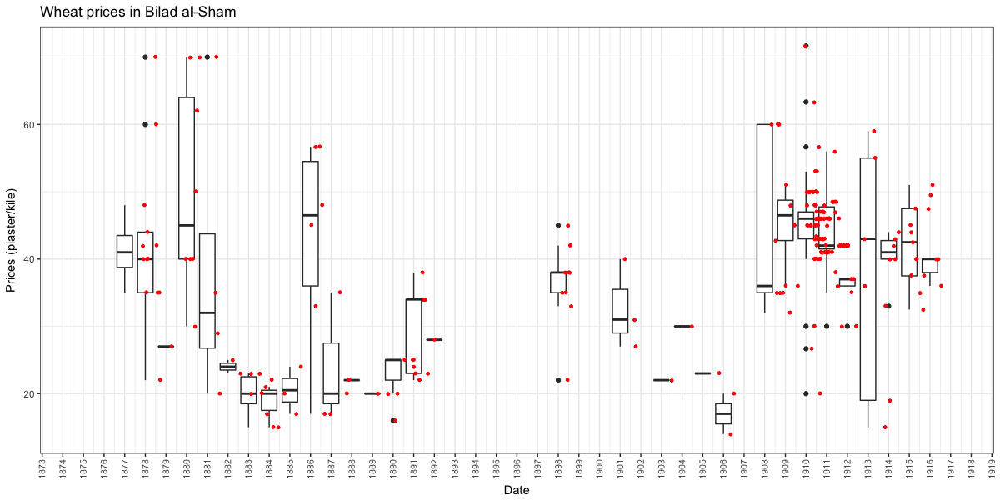

<!-- # processing instructions -->
<!-- ## 1. HTML -->
<!-- pandoc -F pandoc-crossref -s -S -f markdown -t html5 --toc --include-in-header=/BachUni/programming/Pandoc/css-pandoc_online-publication.txt --include-in-header=/BachUni/programming/Pandoc/css-pandoc_code-highlight_oxygen-xml.txt --email-obfuscation=javascript urban-food-riots-in-bilad-al-sham-as-a-repertoire-of-contention.md -o index.html -->
<!-- ## 2. DOCX -->
<!-- pandoc -F pandoc-crossref -s -S -f markdown -t docx urban-food-riots-in-bilad-al-sham-as-a-repertoire-of-contention.md -o urban-food-riots-in-bilad-al-sham-as-a-repertoire-of-contention.docx -->
    

<!-- ORCID -->

<!-- licence -->

<!-- release -->

<!-- DOI -->

# About {#sec-about}

>This paper is  based on a presentation titled "Women in the streets! Urban food riots in late Ottoman *Bilād al-Shām*", which I gave at the conference ["The 'Dangerous Classes' in the Middle East and North Africa"](https://www.sant.ox.ac.uk/events/conference-%E2%80%9Cdangerous-classes%E2%80%9D-middle-east-and-north-africa), St. Antony's college, University of Oxford, 26 January 2017. I thank all participants for their valuable comments.

>The current stable draft of this paper is version [v0.1](https://rawgit.com/tillgrallert/p3601db9e/v0.1/index.html) and contains unprocessed references to sources and secondary literature, cross-references, and CriticMarkup. To comment / review / annotate this version via hypothes.is click [here](https://via.hypothes.is/https://rawgit.com/tillgrallert/p3601db9e/v0.1/index.html). The most recent changes are available [here](https://tillgrallert.github.io/p3601db9e/gh-pages/index.html).

# Introduction {#sec-introduction}

<!-- ## Vignette -->

On 21 August 1908, less than four weeks after the restoration of the constitution in the Ottoman Empire, the daily newspaper *Lisān al-Ḥāl* from Beirut published the following article:

>Large numbers of poor and destitute gathered the morning before yesterday [19. August] (*ijtamaʿa [...] jumhūr kabīr min al-fuqarāʾ wa arbāb al-ʿayyāl*) in front of the government Serail in Beirut. [There,] they cried for help and lamented the current situation and called for the lowering of prices of flour and bread to ease their suffering and those of all other poor; [...] most [wholesale] flour merchants, sellers of flour, owners of ovens and bakeries tyrannise them and profit from [the sale of] sunflower bread in a clear breach of all laws and legal prescriptions (*jamīʿ al-qawānīn wa al-sharāʾiʿ*) until the *raṭl*[^fn1] of bread was sold at more than Ps[^fn2] 7,5. This is contrary to justice (*al-ʿadāla*) and no one can [possibly] accept this. 

>When their [yelling of] complaints grew and their shouting and screaming rose, the vigorous Anīs Efendi Ramaḍān, superintendent of the police, went out to meet them. He soothed their minds with a speech full of courtesy and refinement. He assured them that the authorities directed their zeal and efforts to the lowering of the prices of foodstuffs and thus they withdraw gratefully.

>Their agreement lasted until they were met by a group of their likes, wretched and poor (*jamāʿat min amthālihim arbāb al-ʿayāl wa al-fuqarāʾ*). Together they went to the customs demonstrating in the same manner as before. They scattered the flour [found there] on the floor [in an attempt to] prevent its export from the province and chased away everyone who tried to stop them. Their threatening and menacing was not stopped until the director of the police [arrived] and assured them of the seriousness of the [government's efforts] to secure the necessary funds and reduce the price of food. He explained everything and how it would take less than ten days for the flour calamity (*qaḍiyyat al-ṭaḥīn*) to ease, as well as all other calamities that they complained of. Thus they were appeased.

>Yesterday [20. August] they again gathered and decided amongst them to repeat their demonstrations (*muẓāharāt*) today. Thus they roamed the stores of wheat and all other places where flours is sold. They also demonstrated in expression of their dissatisfaction with the high prices of meat etc.[^cf1]

Despite the officials' promises and explanations the "flour calamity" continued: grain prices in Beirut remained at a constant height at Ps 60 to 62 per *kile*[^fn3] for the best quality of wheat and Ps 35 to 42 for a *kile* of wheat from the Ḥawrān throughout the month of August.[^cf2] Some three weeks after the food riot unspecified "poor people" of Beirut approached the governor general Nāẓim Pasha---already the third in this post since the August incidents---on the occasion of Sultan ʿAbdülḥamīd II's birthday on 16 Shaʿbān 1326 (15 September) with a call to reign in on the merchants and to adopt sufficient measures against the high prices of flour and bread. The merchants responded by claiming that their suppliers in the neighbouring province of Syria were the ones to be held responsible. Thus, Nāẓim Pasha contented himself with establishing an inquiry and an appeal to the merchants to lower prices once the inquiry had come to a conclusion. The last thing we hear of this matter is that the governor general was still waiting for an answer from Damascus.[^cf3]

<!-- ## First observations, core question ## -->

The incident is puzzling: Poor people, suffering from high prices of flour and bread, repeatedly take to the streets in demand for lower prices and in rather orderly fashion. They gather at the seat of the local authorities, complain about greedy merchants, and demonstrate for effective price controls. They do not resort to looting despite flour and wheat being readily available in the city. Even when breaking into warehouses (at the customs) they do not apprehend the food they claim to be unable to afford. They scatter it on the floor instead to prevent its export from the city, which they identified as one of the main reasons for its elevated price. Finally, they failed in achieving any immediate reduction in prices, which remained at an increased level despite the authorities' promises to the contrary. The main question is thus twofold: Why did the protestors opt for this particular form of contentious action even though it proved ultimately unsuccessful and why did they not violently take the food available in the market?

<!-- ## Introduction -->

This paper tries to answer this question by presenting a first analysis of a growing sample of currently 13 <!-- 14 if Baghdad is included --> food riots in Aleppo, Beirut, Damascus, Hama, and Homs at the end of Ottoman rule between the 1870s and 1918 (@tbl:food-riots). The phenomenon of food riots---that is crowds of people assembling in a public place and raising the demand of lower food prices vis-à-vis another group of people---in the Middle East before the IMF riots of the 1970s and 1980s has not yet received sufficient systematic scholarly attention. The current paper represents the first foray into this direction.

<!-- Short outline -->

After an introduction into the overall argument, the first part of this paper focusses on price data and potential correlation with food riots. Focussing on wheat prices as the only available measure, we will see only a limited correlation between high food prices and the occurrence of food riots: while riots occurred only in times of severely elevated prices, high prices not necessarily resulted in a riot having taken place. Secondly, food riots seemingly had no discernible short-term effect on food prices. The second part presents a comparative analysis of the food riots themselves. Noting the apparent failure of food riots to immediately lower food prices and relatively rare instances of looting, which did not commonly target food stores, this paper poses that food riots were neither particularly riotous nor predominantly concerned with food. I argue that the demand for bread had a largely symbolic value and that these contentious performances shared claims and forms to the extent that allows us speak of a shared and, for the period under study, stable "repertoire of contention" or "a limited set of routines that are learned, shared, and acted out through a relatively deliberate process of choice".[^cf4] Protestors could resort to this repertoire in negotiations over political legitimacy *within* the existing political order as based in the provision of *just rule* and *safety of life*. Presenting the components of this particular repertoire of contention, I will also show that the repertoire was neither particularly Islamic nor informed by a "politics of notables".

<!-- introduce my sources -->

This paper employs a systematic reading of five Beiruti and two Damascene newspapers and takes occasional recourse to various other newspaper titles and journals from Beirut, Cairo, Damascus, Istanbul and Jerusalem between 1875 and 1918.[^fn4] Almost all detailed accounts of food riots stem from the contemporaneous local news press. The press also regularly carried information on local retail and wholesale prices (see below). Unlike most narrative accounts of food riots, price information was augmented through foreign archival material such as British, American and German consular reports including the files of the German military and its supply chains in *Bilād al-Shām* during World War I.

<!-- ## summary: argument -->

Following Charles Tilly's work, *food riots* refer to a form of contentious collective action: a group of people assemble in a public place<!-- #td3 --> and raise the demand of lower food prices vis-à-vis another group of people.[^cf5] All food riots in our sample (@tbl:food-riots) conform to this basic definition of a specific *form* of action as well as a specific contentious *claim*. From this follows that food *riots* were not necessarily riotous or violent. Their main purpose was not necessarily (an immediate concern for) *food* either. Rather *food* and *access to food* at *fair prices* had a symbolic and discursive function: The demand for affordable food gained its power from its inherent legitimacy within any political system based on the minimal consent of the ruled to being ruled. As such food riots were part of the negotiations over political legitimacy *within* the existing Ottoman political order. 

<!-- A word on terminology -->

I nevertheless retain the terms "bread riot" and "food riot" in tribute to the existing literature on this phenomenon. Contemporaneous sources did not use a single or specific term to label the events under study. The Arabic denominator for the series of food riots across North Africa and the Middle East in the 1970s and 1980s (IMF riots), namely *intifāḍat al-khubz*, had not yet been coined in the early twentieth century. The common term for reporting food riots in the press was thus the generic "incident" (*ḥāditha*).[^cf6] When food riots turned violent, witnesses referred to a battle (*maʿraka*), such as 1910 in Aleppo,[^cf7] or even *thawra* (rebellion, revolt)[^cf8] and *fitna* (strife),[^cf9] as in Hama and Homs the same year---loaded terms that clearly mark the events as illegitimate.[^fn5] Yet, *Lisān al-Ḥāl* from Beirut acknowledged that the violent foot riot and looting in Homs was "a rebellion of empty stomachs" (*thawrat al-buṭūn al-fāghira*).[^cf10]

<!-- ## Literature review: moral economy ## -->

The argument is informed by the existing scholarship on food riots in other parts of the world since E.P. Thompson's seminal work on the "moral economy of the crowd" in eighteenth-century England and Louise Tilly's work on eighteenth-century France, which agrees that food riots, instead of being spontaneous expression of hunger, were inherently political movements---tactics employed by the lower urban classes to achieve well-defined political aims vis-à-vis a more powerful ruler or ruling class.[^cf11] Thompson and Tilly showed how food riots became particularly important at a paradigmatic shift in the political economy of both France and England. They argued that food riots "marked the nationalization and politicization of the problem of subsistence, and [were] based on a conscious popular model of how the economy should work".[^cf12] Faced with the new model of a market economy, the crowds called on the authorities to obey the "paternalist model", or the "moral economy of provision" of old, in which market inspectors would supervise the direct marketing from the rural producers to the urban consumers and enforce the "just price".[^cf13]  Noting the almost complete failure of food riots in immediately lowering the prices, Thompson argued that the threat of riots functioned as a general check on bread prices in the long term: In order for the anticipation of riots to trigger relief measures, such anticipation had to be occasionally sustained by actual riots.[^cf14] The occasion thus became a tactical choice.

Thompson's original contribution led to a sustained debate about the beliefs and imaginations held among the protestors and whether the reactionary adherence to a "moral economy" could and should be seen as the conclusive explanation of food riots in general.[^fn6] A large body of scholarship on food riots in market economies emerged in the wake of the so-called "IMF riots" in most countries of south America, Africa, and south Asia, including every north-African country, with the exception of Libya, as well as in Turkey and Iran between 1976–1992, which further underlined the nature of food riots as inherently political actions. Scholars noted that such riots did not occur in times of extreme scarcity but in reaction to a highly uneven distribution of available food. As such, the argument runs, food riots document an entitlement gap between popular expectations and realisable supply.[^cf15] 

Scholars also observed that and tried to explain why "Initiators of the [early modern] riots were, very often, the women",[^cf16] with arguments ranging from an almost natural disposal towards mutiny, to being more involved in face-to-face marketing, to women being regarded as the embodiment of disorder, which in turn caused men to dress up as women in a symbolic performance.[^cf17] After the original disappearance of food riots and the exclusion of women from the emerging public sphere of formal politics, female food riots resurfaced in industrial societies of the twentieth century.[^cf18]

<!-- ## Literature review: middle east studies ## -->

<!-- Literature review: stark claim: absence of meaningful literature on this topic -->

With regards to the Middle East, crowds, collective action, and popular contentions have become the core of scholarly scrutiny as well as political and public discourses since the beginning of the ill-labelled Arab Spring.[^fn7] Historical studies have mentioned urban food riots in the Middle East in passing,[^cf19] including some of the riots that form the sample for the present study.[^cf20] Yet, the genealogy of popular participation and urban popular contentions in the Middle East remains largely obscure on the empirical as well as the analytical level.[^fn8]<!--Some comments on the recent books by Chalcraft and Tripp--> Almost thirty years ago Edmund Burke III presented the first foray into a systematic study of collective action in the Middle East over the *longue durée*. He followed the lead of E.P. Thompson and Charles Tilly in abolishing the old cliché of mindless and spontaneous mobs and forwarded three broad claims in his attempt to apply Tilly's "repertoire of contention" to historical Middle Eastern societies: Firstly, that the contentious repertoire *remained* Islamic, arguing that "movements invariably began in the chief mosque of the city",[^cf21] where contentious claims were negotiated among the crowds before *ʿulamāʾ* emissaries were sent to the rulers for negotiations and before the crowds marched onto the authorities; secondly, that the crowds targeted stores and barns; and thirdly that food riots were absent from the protest forms of the nineteenth century.[^fn9] All three claims are proven wrong by the case studies presented in this paper.[^fn10]

# Food prices and food riots {#sec-prices}

Reliable economic data for historical societies of the Middle East is difficult to come by. This is not so much due to a shortage of sources, but larger academic trends away from quantitative economic micro history and the tedious nature of the compilation process. Export statistics from various ports in the Eastern Mediterranean can be gleaned from consular reports[^fn11]; records of the grain exchange in Istanbul are available for scholarly scrutiny; and most newspapers published regular accounts of staple goods and their prices. It seems, however, that only Donald Quataert's seminal thesis on agriculture in Anatolia undertook the task to compile and publish detailed time series of grain prices.[^cf22] Others either published edited consular sources[^cf23] or provide only very limited quantitative data.[^cf24]

<!-- ## Data collection, bias and limitation of newspapers ## -->

It is beyond the scope  of this paper to describe our price sampling methodologies, the resulting sample and our analysis in detail.<!-- This will be done in another paper.--> A short overview must suffice. Time series of price data were compiled from local newspapers and supplemented with information from American, British, and German archival documents. While newspapers regularly published prices, the frequency of such publication varied between locations and over time and is largely unpredictable. Prices were published for different purposes and audiences: Lists of current wholesale prices were made available to merchants and without comment; imperial authorities published price lists for tenders to supply the army; local authorities issued threshold prices for basic necessities; and authors included information on prices in their reports from across the region. Therefore, information on wholesale commodity prices and especially grain prices is more frequently available for the port city of Beirut than the inland cities of Damascus or Jerusalem. Lists of wholesale prices the authorities were willing to pay are more commonly available for Damascus, the seat of an imperial Army Corps. Finally newspaper authors and local authorities tended to focus on prices only when they deviated from the long-term trend---leading to more data points on inflated prices. The only meaningful time series with sufficient data to actually analyse long-term developments thus compiled are prices for a bushel (*kile*) of wheat.[^fn12]

<!-- ## relation between wheat and bread prices -->

Relying predominantly on wholesale prices of wheat for evaluating the relation between changes in food prices and the occurrence of food riots can nevertheless be a fruitful endeavour. This is due to the food economy of *Bilād al-Shām*. First, although information on consumption is scarce, a sketch of the general pattern is possible. The poor majority of townspeople lived mainly on vegetarian provisions, with cereals being their main source of nutrition. They preferred white bread made from wheat---a rule from which they diverted only in times of want, when brown and even black bread became the only options. In accordance with European patterns, their demand for bread, which counted for half of the diet under normal conditions (c. ¼ *raṭl* per day), was highly inelastic and would even rise to ninety per cent in times of want (because all available funds would be spent on bread).[^cf25] Second, voices complaining about expensive or unaffordable bread commonly provided wholesale wheat prices thus linking the two. Third, the relation between a volume of wheat and a weight of bread should not change considerably, save for changes in recipe. Fourth, the vast majority of townspeople had neither an oven nor the means to buy large quantities of grain immediately after the harvest when prices were low and to safely store them for several months. Thus, they relied on the local neighbourhood ovens-cum-bakeries for their daily bread.[^fn13] In this regard it does not matter whether bakeries operated independently from millers and wholesale grain merchants or not: The townspeople were completely dependent on the availability and constant supply of *sufficient* amounts of bread and therefore grain at *affordable* prices within a money-based market economy.

<!-- ## Observations ## -->

{#fig:wheat-prices width=80%} 

@fig:wheat-prices shows the distribution of wheat prices in *Bilād al-Shām* between the late 1870s and the end of 1916. In addition to an annual cycle of rising prices during spring before new harvests arrived at the market in June, prices for wheat fluctuated widely between years. In years of abundant harvests, such as 1882, 1884, 1905 or 1906, prices would fall below the long term average of Ps 20 to 25 per *kile*[^fn14] to Ps 17 and even Ps 14. When calamities such as insufficient winter rains and locusts threatened failing harvests, prices reached Ps 60 per *kile* and more. This data does not mirror the trend of falling grain prices between 1876 and 1905 followed by a sharp increase of some 25 per cent between 1906 and 1908 observed by Donald Quataert for Anatolia. Since that decrease was partially due to American wheat flooding the world markets, it is not surprising that such decrease cannot be observed for Bilād al-Shām which relied on local crops. While average grain prices in Istanbul fell from c. Ps 25"20 per *kile* to Ps 18"20, Ps 25 was considered the normal price in good years in Damascus.[^fn15] The inflation and fluctuation of exchange rates between the gold lira and the silver piaster are of no importance in this context since prices were always quoted in piaster only.[^fn16]

The comparison of the time series of wheat prices across *Bilād al-Shām* with the temporal distribution of food riots (@tbl:food-riots) allows for two observations. On the one hand, we see only limited but certainly no simple causal relations between high food prices and the occurrence of food riots. Food riots coincided with periods of elevated food prices as measured in wholesale prices of wheat. But this cannot be said of the opposite---high food prices did not necessary result in food riots. Thus, while high food prices coincided with food riots in the late 1870s, in 1908 and 1910, extensive archival research has not brought up any report on food riots in 1891 or 1898. The explanatory factor here might be the larger context of the Ottoman Empire. During the late 1870s and from 1909 onwards, the empire's institutions were weakened by wars, resulting in increased conscription among the poor and with it the prolonged absence of men from *Bilād al-Shām*, a state bankruptcy in 1876, the introduction of paper money (*kaime*) subject to high inflation rates, and the state's inability to pay salaries in conjunction with forced subscriptions to finance the war effort among officials. In addition, during both periods the empire underwent rapid political transformations with the declaration of the constitution in 1876 and its restoration in 1908 that were framed by revolutionary discourses of general equality and liberty. Further research on food riots during other periods is necessary to substantiate this argument but the concurrence of these major crises and food riots seems promising.

Date | Place
-|-
1878-03 | Damascus
1880-03-14 | Beirut
1908-08-19 | Beirut
1910-06 | Aleppo
1910-07-02 | Damascus
1910-08-11 | Hama
1910-08-13 | Homs
1911-06 | Hama
1913-02-17 | Damascus
1914-11-13 | Beirut
1914-11-21 | Beirut
1916-02 | Damascus
1918-03 | Damascus

Table: Sample of food riots in *Bilād al-Shām* {#tbl:food-riots}

There were, of course, local factors that contributed to decision whether to engage in a food riot or not. A case in point is the summer of 1910 that saw a series of food riots in Aleppo, Damascus, Hama, and Homs. We have similar reports on high prices, suffering of the poor, and endemic critique of hoarding merchants and adulterated bread as well as idle authorities from Beirut. But despite the bread prices reaching the same threshold of Ps 7"20 as in August 1908 (see above),[^cf26] this time there was no food riot---this absence even served, as an argument against a ban of flour exports from Beirut to Damascus: the province of Syria argued that orders to send all available flour to Damascus would be uphold since there had been no food riot in Beirut and thus it could not possibly have been worse off than Damascus.[^cf27]

On the other hand, the comparison of prices and the occurrence of food riots reveals the inherent failure of these contentious performances in bringing about lower food prices in the short term. We will return to this point in the following section of this paper.<!--  This probably needs another sentence -->

# The repertoire of the food riot {#sec-repertoire}

<!-- ## Intro ## -->

If food prices cannot explain the timing of food riots and if food riots have no discernible short-term effect on food prices, one has to look at the specific events for potential answers to the questions why protestors opted for this specific contentious form and claim and why they did so at these particular times. The sample of 13 <!-- 14 if Baghdad is included --> food riots in Aleppo, Beirut, Damascus, Hama and Homs share enough structural characteristics and the<!--  number? --> reports thereon share enough narrative commonalities to argue that the "food riot" was indeed a "repertoire of contention" (@tbl:repertoire). Charles Tilly's idea of a repertoire as learned and shared routines, as readily-available contentious performances, can help us to make sense of the protestors' seemingly paradoxical choices: they protested in times of destitution, expending calories without being able to eat sufficiently; they protested despite the threat of violent repercussion; complaining about hoarding merchants, the protestors addressed authorities with the demand to enforce threshold prices despite the authorities' apparent inability to prevent such protest or to enforce such prices. 

The repertoire of the food riot in late Ottoman *Bilād al-Shām* can be broken down into a sequence of events that occurred in three phases: a longer prologue of artificially high prices and "inspiring" events conducive to popular protest; the food riot itself that never lasted through the night but could be repeated over some days and which rarely involved the looting of foodstuffs; the immediate aftermath of not more than a month during which the authorities tried to contain the anger through (largely symbolic) investigations and administrative measures (@tbl:repertoire).

<!-- Date | Place | Phase 1 || Phase 2 ||||| Phase 3 | -->
Date | Place | 1. high prices | 2. timing | 3. crowd gathers | 4. seat of authorities | 5. failed intervention | 6.looting | 7. successful intervention | 8. promised improvements | 9. high prices | # of elements
-|-|:-:|:-:|:-:|:-:|:-:|:-:|:-:|:-:|:-:
1878-03 | Damascus | x | x | x | x | - | - | x | x | x | 7
1880-03-14 | Beirut | x | - | x | - | - | x | x | x | - | 5
1908-08-19 | Beirut | x | x | x | x | x | - | x | x | x | 8
1910-06 | Aleppo | x | - | x | - | x | x | x | x | x | 7
1910-07-02 | Damascus | x | x | x | x | - | - | x | x | x | 7
1910-08-11 | Hama | x | x | x | x | x | x | x | x | - | 8
1910-08-13 | Homs | x | x | x | x | x | x | x | x | x | 9
1911-06 | Hama | x | - | x | - | - | - | x | - | - | 3
1913-02-17 | Damascus | x | - | x | x | - | - | x | x | x | 6
1914-11-13 | Beirut | x | x | x | - | - | - | x | x | x | 6
1914-11-21 | Beirut | x | x | x | - | - | - | - | - | x | 4
1916-02 | Damascus | x | - | x | x | - | - | x | x | - | 5
1918-03 | Damascus | x | - | x | - | - | - | - | - | x | 3

Table: Sample of food riots and the elements of the repertoire {#tbl:repertoire}

## The prologue

All food riots were preceded by extended periods of hardship and elevated food prices during which a discourse on *artificially* high prices surfaced in the written sources. The exact timing of the contentious collective action itself then depended on local circumstances.

### 1. Artificially high prices

<!--Available price data shows that prices of grain, flour, and bread were indeed unusually high prior to food riots. -->Prohibitive prices of bread and grain were commonly portrayed as artificially high and blamed on greedy wholesale merchants seeking undue profits from either exporting or hoarding cereals and thus draining the local market. In the case of Damascus and Beirut, exports were usually destined for foreign markets, but in many other inland towns, such as Hama and Homs, the main export destination deemed responsible for price hikes was the provincial capital Damascus.

In the situation of increased and rising prices, some (unnamed) people would begin to criticise (*shakā*) those responsible as evil-doing hoarders and monopolists (*muḥtakirūn*)[^cf28]. Newspapers went to some lengths to emphasise the sinister machinations of the grain merchants, addressing them as the "lords of greed" (*arbāb al-maṭāmiʿ*)[^cf29] responsible for conspiring to form monopolies (*istaʾthara*[^cf30]) and cartels (*iʿtaṣaba*[^cf31]). Opposing such illegal action with reports on legitimate ways of protest, many sources emphasise that criticism had been raised before anything of a violent nature happened and through established channels, such as a petition.[^cf32]

<!-- #### examples #### -->

Thus for example in summer 1910. <!-- ##### ### Aleppo 1910: Prologue ##### -->Aleppo suffered from extremely high prices of wheat in early June 1910 and hoarding merchants were blamed for the calamity. The price of wheat had fallen from Ps 57 to 64 per *kile* to Ps 27 to 30 when some merchants began to buy up all the grain in the market in order to push prices up again. Newspapers singled out ʿAbd al-Raḥmān Efendi Jāsir, a merchant who still held a large quantity of wheat from the previous year's harvest, for having caused an increase to Ps 40 per *kile* through this tactic.[^fn17]

<!-- ##### ### Homs 1910: Prologue ##### -->

Prices were also high and grain was all but unavailable to the poor in Hama and Homs during the summer of 1910 due to a cartel (*iʿtiṣāb*) of grain merchants hoarding and exporting cereals to more profitable locations. In Hama, all available reports[^cf67] blamed greedy wholesale merchants and their attempts to profit from the unrest in the Ḥawran and consequently high grain prices in Damascus by exporting all available cereals to the provincial capital.Some if not all grain merchants in Homs closed their stores arguing that they could not afford to sell at the price imposed by the authorities.[^cf33] Two weeks before a food riot in Homs on 13 August, the commoners (*al-ʿāmma*) had addressed a petition to the authorities explaining their suffering from obscene prices of grain and calling for their intervention to ensure a level humaneness to the poor. But the government did not find a means to satisfy their demand despite ample wheat having been available in the granaries.[^cf34]

### 2. Advantageous moment

<!-- Note that to some extent food riots seem to occur only in times of large-scale political turmoil: the Russo-Ottoman war and its aftermath, the Young Turk Revolution, and the Cretan Crisis of 1910. -->

Once the stage was set and merchants' responsibility for the suffering of the poor was established, protestors seemingly made a tactic decision as to the timing of the contentious collective action---one that would ensure high visibility of the protest, potentially larger crowds of protestors, protection from violent retribution, and maximum embarrassment of the authorities: people took to the streets on Fridays, when towns were crowded with worshippers and shoppers; in close temporal proximity of religious and state holidays, when towns were the stage for large, state-sponsored and affirmative public rituals that displayed a model *of* and *for* society as based in the circle of justice and good governance[^cf113]; and after changes in administrative personnel, when new *vali*s or *mutaṣarrif*s were less likely to be able to rely on local networks of support or command the full loyalty of stationed troops.

<!-- #### examples #### -->

Thus, the food riot of August 1908 in Beirut took place in a time of political turmoil. The Young Turks had just staged their coup and reinstated the constitution of 1876. Their followers and the CUP tried to quickly seize power on all levels of the state administration and across the entire empire, with quick successions of appointments and dismissals of officials and with large-scale public celebrations. When protestors took to the streets on 19 August, Beirut had seen daily popular celebrations and the second governor general in the course of a month had already submitted his resignation[^fn18]---until the poor again raised their suffering from high food prices on the occasion of the Sultanic birthday on 15 Shaʿbān 1326 aH (15 September), at least another two persons would have filled the post.[^fn19]

In March 1878, the governor general of Syria, Cevdet Pasha was new to Damascus and all but one battalion of the 5th Army were absent from the city. Upon the public reading of his firmān of appointment on 8 March, he announced the beginning of an era of rule of law and just government.[^cf35] Food riots began on 12 March and intensified until their culmination on 16 March, which happened to be the day of *mawlid nawbawī*, the Prophet's birthday, on 12 Rabīʿ I 1295 aH. Thirty-two years later, another food riot took place in Damascus one day before *mawlid nabawī* 1331 aH on 17 February 1913.[^cf36]

Similar arguments can be made for the food riots in 1910 in Aleppo, Damascus, Hama, and Homs. Protestors pushed their negotiation power by exercising their constitutional rights to assemble and protest and by employing the new symbolic repertoire of popular rallies and demonstrations---commonly staged in support of the authorities and against foreign enemies[^fn20]---against the authorities themselves in close temporal proximity to official celebrations of the second anniversary of the restoration of the constitution on 24 July (food riots took place in mid-June in Aleppo, on 2 July in Damascus, on 11 August in Hama and two days later in Homs). In addition to this larger context, a new director of police, Nāfidh Efendi, had arrived in Damascus only the day before the demonstration,[^cf37] while the entire *baladiyya* had stepped down on 15 June over a fiscal scandal surrounding the ʿAyn Fīja project.

## The food riot itself

The actual food riot is a bounded event commonly lasting only a few hours. It might be repeated on successive days or within a weeks time but it never continued through the night. Its main characteristics are that large crowds of protestors targeted the authorities in a predominantly peaceful manner calling for the enforcement of *fair* prices (*asʿār muʿatadila*, *taʿdīl al-asʿār*) and that, in the rare cases when violent looting took place, the crowds predominantly looted non-food items.

Good examples for such a sequence of events are the foot riot in Beirut in 1908, outlined at the beginning of this paper, and the food riots in Damascus, Hama, and Homs in 1910. It is worthwhile to look at them in some detail:
<!-- #### ### Damascus 1910: Food riot #### -->
On the morning of 2 July 1910 criers roamed the streets of Damascus, calling on the people to join a demonstration against the high bread prices at Marja Square and in front of the New Serail.^[For a map of Damascus indicating the main locations see <https://github.com/tillgrallert/p04b832f0/blob/master/maps/map_damascus.geojson>] Within an hour, the streets were packed with people marching towards Marja Square. The crowds were headed by a vanguard of women howling and shouting their disgust about the authorities' failure to provide bread at fair prices.[^cf62] The marches united at Marja Square, where women, many of them carrying children and infants, took again the lead and noisily demonstrated under the windows of the New Serail, which was located off Marja Square on the banks of the River Barada.[^cf63] Officials at the various offices around the square became weary and called on the Mushīriyya to send in troops for their protection. The request was complied with and imperial troops dispersed the crowd with threats of violence, through beating, and by sloshing the demonstrators with water from fire engines. The dispersed but agitated crowds spread through the city in search for grain traders, all the while chanting insults and abuse of hoarders, calling on God to deliver them from the tyranny of the monopolists.[^cf64] Yet no looting seemed to have followed from the incident. By the evening, the city was quiet again and the governor general Ismāʿīl Fāḍil Pasha[^cf65] delivered a talk on his recent journey to the southern districts of Kerak and the Hawran at the local club of the CUP.[^cf66]

<!-- map of Damascus  -->

<!-- #### ### Hama 1910: Food riot #### -->

A month later in Hama, a demonstration of poor people against the high prices of bread escalated into a violent food riot on Thursday, 11 August 1910.[^cf67] 
That day, a large crowd of poor men, women, and children marched to the Serail of the mutaṣarrif Nāẓim Bey on the eastern banks of the River Orontes.^[For a map of Hama indicating the main locations see <https://github.com/tillgrallert/p04b832f0/blob/master/maps/map_hama.geojson>] There they demonstrated peacefully against the high profits from the trade of foodstuff and against all exports to Damascus. Nāẓim Bey directed the crowd's anger to the municipality at the opposite, Western, end of the street leading to the Serail. He called upon the *baladiyya* to enforce sufficient measures of price control. However the mutaṣarrif and the municipality could not agree upon their respective responsibilities and dissatisfied by the official response, the crowds dispersed and began to attack stores at three different locations: 

<!-- map of Hama  -->

At first protestors tried to break into the store of al-Mashnūq. When they failed to enter the warehouse, they resorted to throwing stones. They then turned onto the merchant Maḥmūd al-Farrā, whom they identified as the main culprit for their misery. They located al-Farrā at the slaughterhouse and threatened him with murder. Yet, he managed to lock himself inside and escaped. The crowds then split in two.

One group went to the railway station <!-- of the HDP line --> to the south west of the city where large quantities of grain destined for export to Damascus were stored. The protestors forced the gates of some of the surrounding warehouses open and looted some 600 bags of grain without touching any of the railway carriages full of wheat waiting on a side track: The station master, a certain Nabīh Efendi, convinced the crowd that the station with its stores of lentils and onions and all coaches were property of the state and that the Ḥijāz Railway as such was a pious Muslim endeavour (He also allegedly managed to take a photo of the protestors with their loot that was later used for identification). After the successful apprehension of grain, the crowds again targeted <!-- Maḥmūd --> al-Farrā and broke into one of his warehouses at the station that held skins and empty bags, which they again looted. According to *al-Muqtabas*, the crowds then began shouting: "By God, onto al-Bārūdī, onto al-Bārūdī".<!-- Another observer claimed that they indeed forced the station's gates open and looted 600 bags; {muqtabas 164-eap@3} --> 

At the western square they looted the stores of Aḥmad al-Ṣamṣām and Ibn al-Habiyān and of al-Bārūdī and took all the rice, sugar, and coffee they could find. Finally, they looted the warehouse of Aswad and Sharrāḥ in the al-Jisr quarter and took all the grain stored inside.

The crowds could roam the street for two and a half hours without any intervention of the authorities and were finally dispersed by motorised imperial troops (15 men only). *Al-Muqtabas* mentioned the honourable but futile attempt of a single mounted policeman, a certain Khudr Efendi, to disperse the crowd: He got a severe beating and narrowly escaped bruised and bleeding. The newspaper also polemically mocked the commander of the gendarmerie as having said in Ottoman Turkish "Darling, what can we do?" (*canım ne yapalım*) upon his arrival at the scene, after which he retreated with his men.[^cf68] Altogether, it was estimated the rioters looted goods valued at between £T 1500 and £T 2000.[^cf70]

<!-- #### ### Homs 1910: Food riot  #### -->
<!-- mention inspiration by the events in Hama only days before -->

Two days later, on the morning of Saturday, 13 August 1910, an agitated crowd of thousands of poor and destitute people---"among them old and young, the shaykh, the young, the woman, and the infant"[^cf112]---gathered in the Suqs in the Eastern part of Homs and then moved northwards in the direction of the Serail and the baladiyya.^[For a map of Homs indicating the main locations see <https://github.com/tillgrallert/p04b832f0/blob/master/maps/map_homs.geojson>] They gathered without weapons but some claimed with the intent to loot and plunder the grain stores. 
Aḥmad Kurd ʿAlī, the brother of Muḥammad Kurd ʿAlī and co-editor of his newspaper *al-Muqtabas*, was on a journey to the north and quick to travel to the location of the incident from where he filed a number of lengthy reports. According to him the food riot began with a certain Yūsuf ʿAbyān who 

>wanted to buy flour in the quarter of Bāb Tadmur to the east of Homs. But what he wanted could not be obtained because the city had been devoid of this item according to what some papers have written. The man took off his shoes, put both of them on a stick, and began to run and yell: 'oh poor, I am your father. I sacrificed my life for your sake' (*ayyuhā al-fuqarāʾ fa-ana abūkum afādī bi-ḥayātī fī sabīlikim*).[^cf38]

<!-- As mentioned above, the whole affair allegedly began when a certain Yūsuf ʿAbyān could not find any flour to buy -->.

<!-- # Unclear sequence -->

Despite numerous long reports in the news press, the sequence of events is not entirely clear but demonstrations and looting occurred in at least four different locations: the square in front of the Serail, warehouses in the vicinity of the municipal garden, the Tripoli-Homs coach station, and the railway station on the Damascus-Hama line. Some early and generic reports also mentioned the looting of flour and bread from bakeries.[^cf72]

<!-- map of Homs  -->

<!-- # 1. Demonstration at the Serail -->

Reports agree that the first confrontation between protestors and the authorities took place in front of the Serail.[^cf73] <!-- Earlier reports claim that, having met no resistance, the crowds went to the warehouses in the vicinity of the government Serail in the afternoon, which they broke into and began to loot.[^cf74] According to *al-Ittiḥād al-ʿUthmānī*, popular hearsay later blamed Maḥmūd ʿAjam for inciting the crowds to turn to the government Serial and the Ottoman bank in his attempts to protect the warehouses.[^cf75] The final report in the same newspaper, published nine days after the events, claimed that the -->
According to *al-Ittiḥād al-ʿUthmānī*'s final report on the incident, the crowds marched through the streets and directly to the Serail, "shouting slogans, swearing and cursing (*maʿnāhu al-sibb wa-l-shatm*) everybody not marching with them".[^cf76] There they held a demonstration and called on the authorities to reign in on the merchants and prevent them from exporting grain from the city.
<!-- Be that as it may, crowds had gathered on the square in front of the Serail where the Kaimakam, ʿAṭā Allah Bey al-Ayyūbī, and 3--4 gendarmes and police confronted them. -->
They were confronted by the Kaimakam, ʿAtā Allah Bey al-Ayyūbī, with a small detachment of 3--4 gendarmes and police.[^fn22] He delivered a speech, threatening, pleading, cautioning, and promising to cut the price to Ps 3 for a *ratl* of<!-- #td7--> flour.[^cf77] According to Aḥmad Kurd ʿAlī, the crowds rejoiced over the announcements of the Kaimakam and would have left, if it had not been for some riff-raff among them.[^cf78] A certain T.ʿ.M. reported in *al-Ittiḥād al-ʿUthmānī* how some of the nobles and officials began to disperse the crowds after the speech of the Kaimakam and thus initiated a skirmish of thrown stones in the course of which the demonstrators realised their strength and then began to attack warehouses.[^cf79] However the violent confrontation might have begun, the kaimakam gathered all the gendarmes he could muster---about ten men---and ordered them to shoot into the air to disperse the protestors. The protestors fled the shooting but at least two groups went on: one stayed in town and looted further warehouses, the other attacked the railway station.[^cf80] Meanwhile the Kaimakam called for reinforcements from Hama and Damascus.

<!-- # 2.1 Looting of warehouses -->

One part of the crowd went from the square of the Serail to the warehouses of the grain merchants and looted the stores of Muṣṭafā ʿAbbās, Najīb Laṭīf, and Muṣṭafā Efendi Arslān in the vicinity of the municipal gardens adjacent to the Serail.[^cf81] 

<!-- # 3. attack on the Tripoli-Ḥomṣ coach road station -->

<!-- This is only reported in *al-Muqtabas* and seemingly did not result in looting -->

The second group went to the Tripoli-Homs coach road station and attempted to break into warehouses and loot them.[^fn23] There they encountered the gendarme Tawfīq Efendi al-Atāsī<!-- , who had happened to be at the scene -->. He was attacked with stones, hit on the forehead, and wounded. The Kaimakam arrived with three gendarmes, but they were also met with showers of stones and he had to retreat with the commander of the gendarmerie to the Serail, from where they again tried to rescue al-Atāsī by threatening the use of fire arms. This stopped the crowd and the protestors dispersed. Al-Atāsī and the commander of the gendarmerie escaped bleeding from their heads.[^cf82] 

<!-- # 4. Attack on the railway station -->

Yet another part of the crowd went to the railway station outside the city to the south west,[^cf83] where a train of some 16 wagons [^fn24] with grain, fat and manufactured goods from Hama and Homs was parked destined for export. They began looting the wagons.  When three gendarmes and some volunteers---(the already wounded) Tawfīq Efendi al-Atāsī, Badawī Efendi al-Sibāʿī, and Aḥmad al-Sibāʿī and the municipal bailiff (*jāwīsh*) Ahīn Ibn Diyāb---arrived at the scene, the looters abandoned the wagons and went for the warehouses in search for grain. A vanguard of the protestors had already forced their way into the stores located at the vicinity of the station and looted the Khān al-Salmūniyīn, Khān Bayt al-Ṭayf, Makhzan Bayt Baḍrīṭa, Makhzan Bayt Ṭalīmāt, Makhzan Farkūḥ, and a number of other warehouses not identified by name.[^cf84] According to one report the gendarmes were insulted during the altercation and received a severe beating (again). At some point they even had to surrender their arms, which were later returned to them.[^cf116] In another version of the story, the station officials defended themselves by the same means as the protestors, i.e. by throwing stones at the looters. A mounted Circassian, called Idrīs, drove his horse into the crowd in order to relieve the defenders, but he was repelled with showers of stones.[^cf86]

<!-- This seems to be unrelated to the railway station. According to {Asʿad 1984@420}, the Khān al-Zahrāwī was located in the Ḥamīdiyya quarter, who also recounted the defence of the khāns by the Zahrāwīs -->

<!-- # Looting and violence dying down -->

Looting and violent attacks continued sporadically into the evening with groups of agitated people roaming the streets and inciting speeches being delivered across the town. Crowds only dispersed in the evening when darkness fell.[^cf87]

The narratives about these incidents are fascinating and deserve a study of there own---what, for instance, is the political agenda behind *al-Muqtabas*' mocking polemic of the commander of the gendarmerie in Hama, providing a most probably unsubstantiated quote in Ottoman only? However, we presently are concerned with food riots as contentious performances and with establishing a set of features that are common to most, if not all of them.

### 3. Formation of a crowd

Invariably food riots commenced with the gathering of a crowd of townspeople---commonly qualified as being from among the poor. Sometimes authors emphasise the inclusive character of the crowd by mentioning men, women, and children, old and young, etc. At least in Damascus, women were portrayed as leading the crowds or even as the majority of participants. <!-- and none of the of the contemporaneous sources found that worth commenting on --> Unfortunately the identities of protestors cannot be established beyond such generic descriptions. The only exception is the above-mentioned Yūsuf ʿAbyān from Homs.
<!--; with a single exception:  When a food riot took place in Homs on 13 August 1910, Aḥmad Kurd ʿAlī, the brother of Muḥammad Kurd ʿAlī and co-editor of his newspaper *al-Muqtabas*, was on a journey to the north and quick to travel to the location of the incident from where he filed a number of lengthy reports. According to him the food riot began with a certain Yūsuf ʿAbyān who  -->

<!-- >wanted to buy flour in the quarter of Bāb Tadmur to the east of Homs. But what he wanted could not be obtained because the city had been devoid of this item according to what some papers have written. The man took off his shoes, put both of them on a stick, and began to run and yell: 'oh poor, I am your father. I sacrificed my life for your sake' (*ayyuhā al-fuqarāʾ fa-ana abūkum afādī bi-ḥayātī fī sabīlikim*).[^cf38] -->

<!-- ### terminology -->

The terms for labelling the crowds of protestors and their gathering together were mostly derivatives of the roots *j-m-ʿ* and *j-m-h-r*, i.e. *tajamhara*[^cf39], *ijtamaʿa*[^cf40], *tajammaʿ*[^cf41] and *jamʿ* / *jumūʿ*[^cf42] and *jumhūr*[^cf43] / *jamāhīr*.[^cf44] As such, these signifiers do not carry a moral judgement. Reports commonly emphasised the needy state of the protestors. Thus, we are informed about the gathering of "a large crowd of poor" (*jamm ghafīr min al-fuqarāʾ*)[^cf45] and "crowds of poor inhabitants" (*jumūʿ al-fuqarāʾ min al-ahālī*)[^cf46]. The presence of women further underlined the neediness of the protestors: in Damascus "a crowd gathered of poor women" (*ijtamaʿa jamīʿ al-fuqarāʾ min al-nisāʾ*)[^cf47] in March 1878; also in Damascus, "crowds of women banded together [...] in front of the Serail" (*kaththarat jumūʿ al-nisāʾ*)[^cf48] some thirty-two years later in July 1910, "carrying small boys and infant girls on their arms"[^cf49] "until the streets were congested; women leading and the men behind them like the main force" (*ḥatā ghaṣṣat al-shawāriʿ wa-l-nisāʾ fī al-muqaddima wa al-rijāl min warāʾihin ka-quwwat al-ẓahr*)[^cf50]; and in February 1916, "the town hall was congested by poor women" (*izduḥimat ams dār al-baladiyya bi-l-faqīrāt al-nisāʾ*)[^cf51]; in Aleppo, "poor Muslims, women and men, gathered together" (*tajamhara* [...] *fuqarāʾ al-muslimīn nisāʾan wa-rijālan*)[^cf52] in June 1910; ʿUmar Ṣāfī reported from Ḥomṣ two months later that those looting the grain stores were unarmed since they were "poor, women, and children".[^cf53] This pattern of explicitly stating the all-encompassing character of the protest was not limited to foot riots;  a report on the protest of Algerian refugees who had assembled in front of the Serail in Beirut in January 1910 read: *tajammaʿ ʿadad wāfir bayn rijāl wa-nisāʾ wa-awlād min al-muhājirīn al-jazāʾirīn al-fuqarāʾ*.[^cf54]

The gathered people were labelled with neutral terms such as *al-qawm* (groups of people)[^cf55], *al-ʿāmma* (the commoners)[^cf56] or *al-shaʿb* (the populace)[^cf57]---unless the food riot turned violent. Then reports immediately switched to terms denouncing the crowds' actions as illicit. Violent protestors were portrait as rebels (*thāʾirūn*[^cf58] or *thuwwār*[^cf59]) and the crowds were denounced as a mob of riff-raff (*al-raʿāʿ*[^cf60] and *al-ghawghāʾ*[^cf61]).

### 4. Peaceful demonstration

In most cases <!-- but not Aleppo 1910--> the crowd gathered at or marched onto the seat of the local government, be it the municipality, the seat of the district or the provincial authorities. There they peacefully raised their complains of hoarding merchants and their demand for affordable bread and grain through intervention of the authorities, namely the enforcement of the *just price*. What sets food riots apart from other forms of contentious performances, such as the mutiny of soldiers or inter-communal violence, is that protestors took neither recourse to an Islamicate repertoire nor to the "politics of notables": We do not have a single report of crowds assembling at a central mosque or of notables acting as intermediaries between the populace and the ruling authorities.[^fn21] The importance of the latter point cannot be overstated. In the wake of Hourani's seminal article, the class of local intermediaries, commonly referred to as *ʿayān*, and their importance for the governance of *Bilād al-Shām* and the Ottoman *ancien régime* has become a token in scholarly literature[^cf115]---to the extent that Dana Sajdi lamented the prevalence of "ʿayān-ology" among scholars of the modern Arabic-speaking provinces of the Ottoman Empire in the eastern Mediterranean<!--  Levant -->, even though they lacked an "agreement on how this category is constituted."[^cf114]

### 5. Dissolution of the crowd or escalation into a riot

Once the claim was made at the seat of the authorities, representatives of the state attempt to appease the gathered crowds, acknowledging and affirming the inherent legitimacy and justness of their demands and trying to dissolve the potentially dangerous gathering through a combination of promises, threats and real violence. In those instances when crowds, making use of the urban topography and the most prominent square in town, did not gather in front of highest political authority, the head of the *baladiyya* or the *kaimakam* at whose offices the demonstration took place tried to redirect the crowd's anger to the higher authority of the *vali* or *mutaṣarrif*. 

The authorities' initial reaction was the decisive factor in deciding whether a rather peaceful demonstration turned into a violent riot and looting. If they failed in their attempt to ultimately dissolve the crowd by whatever means, the agitated crowd began roaming the streets and searched for other targets.

### 6. (optional) Rioting and looting

Crowds finally turned on the merchant class identified as responsible for the general calamity both by the protestors and the authorities. Groups of people violently loot warehouses and stores. They particularly target warehouses at railway and coach stations as part of the vilified export trade. However, in all but one case, when grain storages are looted at the railway station of Homs, the looters preferred anything but food and thus seem destined to inflict harm upon their oppressors rather than interested in satisfying their demand for food. Local authorities, already tainted by their earlier failure are portrayed as utterly helpless and incompetent during the violent part of the collective action.

### 7. Successful intervention of the highest representative of the central authorities

Peace and tranquillity as the defining basis of Ottoman political legitimacy---*asāyiş-i ʿumūmī* or *al-rāḥa al-ʿumūmiyya*---are finally re-established by the intervention of the highest representative of the central authorities, namely the *vali* or the *mutaṣarrif*, and with the help of imperial troops or the gendarmerie.

## The aftermath

The aftermath of a food riot commonly saw two diametrically opposed developments. On the one had the press published long eulogies of the central authorities in the person of the governor general for punishing the hoarders and for enforcing fair maximum prices. On the other hand, no factual report on actually falling food prices can be found.

### 8. Official investigation

After violence is quelled or after the peaceful demonstration is dissolved, the highest representative of the central authorities commonly engages in a flurry of activities demonstrating the empire's energetic intervention to restore justice: committees are set up to investigate the (pre-established) cause for high prices, namely hoarding merchants; exports of grain are (again) banned; wholesale merchants are reprimanded for the artificial price hikes; some grain is confiscated from the hoarding merchants (but not re-distributed); and official maximum prices for grain, flour and bread are again published through the officially responsible municipalities. Only in a single instance, when the protestors looted grain stores in Homs in 1910, the authorities prosecuted the protestors themselves. Otherwise, protestors went unpunished (but not necessarily unhurt), which is both an affirmation of their protest's legitimacy (in form and content) and a tacit acknowledgement of the impossibility of effective law enforcement.

<!-- #### examples #### -->

<!-- ##### Aleppo 1910: Aftermath ##### -->

For a number of days after the riots in Aleppo in June 1910, soldiers patrolled the quarter of al-Jalūm to preserve safety and public order. The authorities arrested the culprit, i.e. ʿAbd al-Raḥmān Efendi Jāsir, and seized his stores of grain and sold (some of it) in public auction. The governor general<!--  who? --> counselled all other grain merchants to immediately sell a large quantity of wheat. In addition, he prohibited the export of grain from the province.[^cf88]

<!-- ##### Damascus 1910: Aftermath ##### -->

Two weeks later in Damascus, the governor general invited the leading notables and dignitaries of the city, the *imām*s of the quarters, and their *mukhtār*s for separate meetings to the Serail on 3 July and severely reprimanded them over the previous' days demonstrations. He explained that while the people had the legal right to gather and to petition the authorities, yesterday's events were outright illegal as they inflicted harm upon the homeland. As the notables and heads of the land (*bilād*) they had the duty to counsel the people in comprehensible language that such actions were not advisable.[^cf89] In addition, provincial authorities wrote to the districts of Hama and the Ḥawrān as well as the neighbouring province of Beirut imploring them to send whatever supplies of wheat they had to Damascus. In Damascus itself, the municipality set the maximum price for a *raṭl* bread of good quality at Ps 3"30 and took some unspecified measures against merchants suspected of hoarding.[^cf90] One week after the food riot, *al-Bashīr* reported that the provincial administration council had investigated the high prices of wheat and come to the conclusion that the sole culprit were hoarding merchants. Consequently, the council banned this practice.[^cf91]

<!-- ##### Hama 1910: Aftermath ##### -->

In the aftermath of the food riot in Hama on 11 August 1910 (called *ḥādithat Ḥamā*[^cf92] and *fitna*[^cf93]), the authorities set up an investigating committee to establish the reasons for the price hikes and to identify the looters. Both the mutaṣarrif and the governor general of Syria issued orders against inflated prices and banning exports from Syria. But while the press riled for punishment of all monopolists, reports on falling prices are nowhere to be found.

<!-- ##### Homs 1910: Aftermath ##### -->

<!-- # The next day -->

In Homs, the Kaimkam and the small number of gendarmes under his command began conducting door-to-door searches for looted goods after an uneasy but quiet night on 14 August 1910. Those found in possession of stolen wheat were arrested. At noon, an official investigation was set up with the participation of gendarmerie, the public prosecutor of the province, who had arrived from Damascus for this purpose, and the local authorities.[^cf94] In the evening arrived a company (*bölük*) of imperial troops as reinforcement from Damascus to prevent further rioting and to help recover the loot.[^cf95] 

<!-- # The following days -->

That night looters tried to rid themselves of the stolen grain in anticipation of retribution. Some buried it in their homes, some hid it underneath legitimate grain, but many threw the cereals into the streets the moat of the citadel and into sewers.[^cf96] The following day, the Kaimakam and the public prosecutor of the Kaza continued their door-to-door searches and arrests. Within a week about 100 people were sentenced and 49 were arrested for their participation in the looting (i.e. more than half of them were never apprehended).[^fn25] Recovered foodstuffs were brought to the Serail.[^cf97] The merchants gathered and called upon the authorities to either surrender the confiscated grain or pay the official price, as was their right under the law.[^cf98] 

<!-- # Attempts to lower prices -->

Finally the local authorities tried to enforce lower prices. Municipal criers walked the streets of Ḥomṣ under orders of the president of the *baladiyya*, Muḥiyī al-Dīn Efendi Shams al-Dīn, announcing the prohibition of grain exports to destinations outside the province. Those found guilty of breaching these orders would be punished and their grain would be seized.[^cf99]

### 9. No reports on falling grain prices

Finally and despite all the praise of a successful intervention by the central authorities, food prices did not fall in any significant way in the immediate aftermath of a food riot. In many instances they even continued to rise before the arrival of new harvests causes the common cyclical decrease.

<!-- #### examples #### -->

<!-- ##### Aleppo 1910 ##### -->

According to a generic note in *al-Bashīr* the measures undertaken by the authorities in Aleppo were successful and the price of grain fell[^cf100] but in early July 1910 the *kile* of wheat was still sold at Ps 64[^cf101]---the same price that had been reported as the maximum price at the onset of the events. In mid-August Aḥmad Kurd ʿAlī reported from Aleppo that false rumours of locust destroying the harvests were used to justify continuously high prices. He complained that the *kile* was still sold at Ps 30 to 39.[^cf102]<!-- This is important information on acceptable prices.-->

<!-- ##### Damascus 1910 ##### -->

In Damascus, the price of wheat fell to Ps 53 per *kile*[^cf103] on 2 July 1910, the day of the riot. Two months later prices had hardly fallen. The *baladiyya* convened a meeting of bakers and millers on 29 August and announced new maximum prices for flour at Ps 40 to Ps 57 per *wazna* and for bread at Ps 3 to Ps 3"35 per *raṭl*, depending on the quality[^cf104]---which is almost the same price as the Ps 3"30 per *raṭl* of good bread issued on the day of the riot.

<!-- ##### Damascus 1913: Aftermath ##### -->

Two weeks after the food riot on 17 February 1913 in Damascus, *al-Muqtabas* reported a 30 per cent drop in the price of a *wazna* of flour from Ps 6"20 to Ps 4"20.[^cf105] A day later, on 3 March, the *baladiyya* set a new maximum price for the *raṭl* of bread at Ps 4.[^cf106] However, on 6 March, *al-Muqtabas* stated that against all hopes the price of grain had not fallen.[^cf107] The MP for Damascus, Shukrī al-ʿAsalī, lobbied for easing the price of wheat through lifting all import customs for the duration of two months[^cf108] but at the end of March, wheat was still sold at Ps 59 to 65 per *kile* because up to three quarters of all millers did not adhere to the prices established by the *baladiyya*. Therefore a meeting of millers and flour merchants was convened at the municipality on 30 March[^cf109], at which the merchants claimed they could not possibly buy wheat at lower prices and that they would have to sell at even higher prices in consequence.[^cf110] Prices reached up to Ps 80 per *kile* of wheat a week later.[^cf111]

# Conclusion {#sec-conclusion}

<!-- Look at form, demand/claim, and function -->

This paper presented the first systematic attempt of a study of food riots in *Bilād al-Shām* during the final decades of Ottoman rule. A brief foray into a time series of wheat prices across the entire region showed the limited explanatory power of food prices for the occurrence of food riots. On the one hand, periods of high food prices did not necessarily result in food riots and food riots were never successful in bringing about lower food prices, on the other. I then turned to micro studies of individual food riots and forwarded the observation of significant structural similarities between them that can be broken down into three different phases and a sequence of bounded events common to (almost) all food riots. 

<!-- summarise the repertoire again -->
<!-- emphasise the absence of an Islamicate repertoire and the "politics of notables" -->

I argued that such a shared and learned repertoire can serve to answer the question why protestors did engage in food riots although they constantly proved unsuccessful in achieving their stated claim and why they did not commonly take food by force. The demand for bread at *affordable* and *established* prices was largely symbolic---as attested by the constant failure of the protest in securing their demand---and part of the larger negotiation of political legitimacy in times of internal and external crisis. In line with the "moral economy" of English and French crowds in the seventeenth century, protestors called on the rulers to obey the *ancien régime* of paternalist obligations towards the ruled. The demand for bread was chosen because it was (and is) inherently legitimate. Coupled with a discourse of greedy merchants, who were ultimately to blame either for the enforcement of an *unfair* market economy governed by the forces of supply and demand or for sabotaging the fair negotiation of prices through the formation of cartels and hoarding, the protestors offered the authorities a way forward: reign in on the merchants, re-establish authority over public affairs, and win our continued loyalty as Ottoman subjects.

# Notes

[^fn1]: Across *Bilād al-Shām* the basic weight was the *uqqa* of 400 *dirham*, roughly equalling 1,282 kg. For food items such as bread and flour, the *raṭl* (pl. *ruṭūl*, *arṭāl*) of two *uqqa* was the common weight; {Goering 1878a@489; ReichsamtDesInnern 1880@233; PoidsMesuresMonnaiesEt 2002@5-7, 53; Inalcik 1985@338-40; Mishāqa 1889n}.

[^fn2]: One Ottoman gold *lira* (£T) was nominally divided into 100 silver piaster (Ps, *kuruş* / *qurūsh*) and 400 copper *para* (*bārā*) since the introduction of bimetallic standard in 1844. Prices of every-day items and foodstuffs were commonly cited in piaster. The silver *mecidiye* coin of Ps 20 was the base for most transactions. Due to falling world market prices of silver, the Ottoman Empire devaluated the *mecidiye* for the purpose of tax payments from Ps 20 to 19 in 1880. The official exchange rate between gold *lira* and silver piaster was set to Ps 123 in May 1883 for the same reason. Local rates varied widely across time and *Bilād al-Shām* with a continuous trend of further devaluation of the piaster coin.

[^cf1]: {lisan 5795a@3}

[^fn3]: The bushel (*kile*) was the basic unit of the cereals trade (grain, flour, and dough) in the Ottoman Empire and across *Bilād al-Shām*. The *kile* was divided into 2 *madd* and also referred to as *jift* (Ottoman *çift*: pair). Centralisation efforts to establish an imperial standard bushel (*Istanbul kilesi* or new *kile*) of 40 litre were not successful. In *Bilād al-Shām* a *kile* equalled about 36,8 litre.  A less common volume was the *shunbul*, which equalled 3 *kile* in Aleppo and 2,25 *kile* in the ports of Tripoli and Acre; {AlQasimi 1960b@291; PoidsMesuresMonnaiesEt 2002@6-7; Inalcik 1985@333; Mishāqa 1889n; lisan 645a; Mishāqa 1889o; Devey 1912a}.

[^cf2]: {bashir 39-1869;bashir 39-1871;bashir 39-1873}

[^cf3]: {lisan 5820@1;thamarat 1691a@4}

[^cf4]: {Tilly 1993@264}

[^fn4]: These are the Beiruti newspapers (dates in brackets indicated the periods consulted): *Ḥadīqat al-Akhbār* (1881–88, semi-official weekly), *al-Bashīr* (1878–82, 1887–1910, weekly), *al-Janna* (1883–84, weekly), *Thamarāt al-Funūn* (1875–95, 1898–1900, and 1902–1908, weekly), and *Lisān al-Ḥāl* (1877–1914, bi-weekly, since 1894 daily); and from Damascus the official gazette *Sūriye* (1882–88, 1899–1902, weekly) and, with changing titles, *al-Muqtabas* (1908–14, daily). The journals are *al-Jinān*, *al-Maḥabba*, and *al-Ḥasnāʾ* from Beirut, *al-Ḥaqāʾiq* from Damascus, *al-Muqtaṭaf* in Beirut and later Cairo, *al-Muqtabas* in Cairo and later Damascus, and *Servet-i Fünūn*, *The Levant Herald*, and *Konstantinopler Handelsblatt* from Istanbul. The newspapers of *al-Ittiḥad al-ʿUthmānī* and *al-Iqbāl* from Beirut and *al-Quds* from Jerusalem were consulted for periods of a few weeks surrounding individual food riots.

[^cf5]: {Tilly 1987@227}

[^cf6]: E.g. {bashir 1969f; muqtabas 162-eap; iqbal 9-361; ittihad 583; lisan 6408a; jarmuq 453b@1-2; ittihad 588}.

[^cf7]: {lisan 6359; muqtabas 122-eap}

[^cf8]: {muqtabas 162-eap; ittihad 583; ittihad 586a; lisan 6408a; ittihad 588}

[^cf9]: {iqbal 9-360; ittihad 583}

[^fn5]: See {Ayalon 1987;Rebhan 1986@110ff} for the historical semantics of both terms. On the Ottoman preference for *fitna* as a term for open rebellion against the state see {Reinkowski 2005a@242; Sariyannis 2005@9-10; Brummett 1998@93, 102}.

[^cf10]: {lisan 6408a}

[^cf11]: {Thompson 1971; Tilly 1971}

[^cf12]: {Tilly 1971@26}

[^cf13]: {Thompson 1971@83, 85–86, 117, 136}

[^cf14]: {Thompson 1971@120-126}

[^fn6]: E.g. {Scott 1985; Mitchell 1990; Bohstedt 1983; Bohstedt 1992}. A lot of the debate focuses on the sustainability of hegemonic ideas, or the ideas of the ruling classes, through persuasion or coercion. See also George Rudé's work on the formation of popular ideologies as an always specific amalgam of inherent and derived ideologies and the "the circumstance and experience which, in the final analysis, determined the nature of the finale mixture."; {Rudé 1995@29}.

[^cf15]: {Walton 1994@39-40; Patel 2009; Sen 1981}; see also {Liauzu 1989}, {Burke 1989} and other contributions in the same volume.

[^cf16]: {Thompson 1971}

[^cf17]: For a summary of these arguments see {Bohstedt 1988}.

[^cf18]: C.f. {Taylor 1996}. On the emergence of the idea of women as housewives and mothers of the nation in Mount Lebanon see  {Khater 1996}.

[^fn7]: C.f. Recent monographs such as {Tripp 2013; Chalcraft 2016}.

[^cf19]: These include a female food riot in Acre in 1816 ({Philipp 2001}),  eighteenth-century food riots in Aleppo ({Thieck 1985}), Cairo  ({Baer 1977}), and  Damascus ({Grehan 2003; Grehan 2006; Grehan 2007})

[^cf20]: These include the 1878 food riot in Damascus ({AbuManneh 1998@253; Reilly 1995; Reilly 1987a@89}), the 1910 food riot in Homs ({Reilly 1996@222}), and the 1914 food riots in Beirut ({SchulzeTanielian 2014@737, 742}).

[^fn8]: C.f. {Ağir 2013@591} for similar observations.

[^cf21]: {Burke 1989@46}

[^fn9]: {Burke 1989@45-51}.

[^fn10]: Burke's misjudgement was mainly due to the sample upon which he built his case, and which was limited to urban riots in Cairo and Damascus only between 1750 and 1830⁠. The sample was outlined in an earlier publication; {Burke 1986@339}. Nevertheless, Burke repeatedly reiterated these claims; e.g. {BurkeIii 2004}.

[^fn11]: See, for instance, the annual trade statistics for each consular district published in the British House of Commons Parliamentary Papers, which are available online through ProQuest; <https://parlipapers.proquest.com> (requires an institutional subscription).

[^cf22]: {Quataert 1973}

[^cf23]: E.g. {Issawi 1988}

[^cf24]: E.g. {Shields 1991@22} provides a table of only 14 data points based on British consular reports.

[^fn12]: As far as the relationship between local volumes was known, they have all been normalised to *kile*. Our data is openly available at <https://doi.org/10.5281/zenodo.1008999>.

[^cf25]: {Jago 1871@394-395; TheLevantHerald 1877i@2; Grehan 2007@66-9; Grobba 1923; Schilcher 1991@174; Thompson 1971@91-2; Jago 1879k@615; lisan 5137a; bashir 1761; Richards 1898i; bashir 1815}

[^fn13]: The *Sālnāme* recorded 117 *furūn* in Damascus for the early 1880s; {Syria salname 1300@254-255}.

[^fn14]: C.f. {Goering 1878b@501-22; VonSüdenhorst 1873@23-26; Richards 1901g}. <!--add references to the actual dataset of wheat prices-->

[^fn15]: See {Quataert 1973@187ff, 367ff}, {bashir a1331a; Richards 1901g}.

[^fn16]: Prices in other currencies, such as those in US Dollar or British Pound Sterling reported by the consuls to London or Washington, DC, are not currently included in the price data.

[^cf26]: {lisan 6369; lisan 6370; iqbal 9-356}

[^cf27]: {bashir 1974}

[^cf28]: E.g. {jarmuq 412a; lisan 6369; bashir 1971; muqtabas 162-eap; iqbal 9-360; ittihad 582}

[^cf29]: E.g. {lisan 6359}

[^cf30]: E.g. {lisan 6408a}

[^cf31]: E.g. {ittihad 583; muqtabas 75-eap@3}

[^cf32]: E.g. {lisan 6408a}

[^fn17]: {lisan 6359; bashir 1969f; muqtabas 122-eap}. Prices were originally provided per *shunbul* and normalised to *kile*: 1 *shunbul* = 3 *kile*.

[^cf33]: {muqtabas 162-eap; ittihad 583; ittihad 585a; ittihad 586a}

[^cf34]: {lisan 6408a}

[^fn18]: Muḥammad ʿAlī Bey Efendi arrived on 27 July and his successor ʿAlī Akram Bey Efendi submitted his resignation within two days of his arrival on 16 August; {lisan 5773; tf-oib 1683; bashir 39-1871; iqbal 35-260; tf-oib 1686}

[^fn19]: Another ʿAlī Akram Bey was appointed and replaced with Farīd Pasha as acting governor general until the arrival of Nāẓim Pasha on 7 September; {iqbal 35-261; iqbal 35-262; lisan 5808;lisan 5809}

[^cf35]: {lisan 43; Jago 1878l; Cooke 1968@14, 31, 57–58}

[^cf36]: {muqtabas 561-eap}

[^fn20]: After the Young Turk Revolution of 1908, the empire saw the emergence of a new symbolic repertoire of public rituals, namely the "popular" demonstration against foreign adversaries of the empire---the novelty being the active participation of the population in these demonstrations in addition to their traditional role as spectators. Occasions were Austria-Hungary’s annexation of Bosnia and Herzegovina in 1908/09, Greece’s intervention in Crete in 1910, the Italian occupation of Tripoli in Libya in 1911/12, or the Balkan War of 1912–13; for more details on this argument see {Grallert 2014@323-325, 342}. 
For reports on demonstrations against Greece during the Cretan crisis in 1910 see {jarmuq 378@3; jarmuq 379@3; jarmuq 380@3; Young 1910; iqbal 9-349@5-6; lisan 6355@2; iqbal 9-352@5; lisan 6356@2}.
<!-- Damascus: {jarmuq 378@3; jarmuq 379@3; jarmuq 380@3; Young 1910} -->
<!-- Beirut: {iqbal 9-349@5-6; lisan 6355@2; iqbal 9-352@5} -->
<!-- Haifa: {lisan 6356@2} -->

[^cf37]: {jarmuq 429; lisan 6385; jarmuq 430}

[^cf38]: {jarmuq 453b@1-2}

[^cf39]: {bashir 1969f; muqtabas 161-eap@2; bashir 1977d; muqtabas 164-eap}

[^cf40]: {lisan 6359; jarmuq 412a; jarmuq 413; iqbal 9-360; ittihad 582}

[^cf41]: {iqbal 9-361}

[^cf42]: {jarmuq 412a; lisan 6369} {ittihad 583; lisan 6408a; jarmuq 450@3}

[^cf43]: {lisan 6359}

[^cf44]: {jarmuq 453b@1-2}

[^cf45]: {muqtabas 561-eap}, c.f. {muqtabas 122-eap; ittihad 583}

[^cf46]: {ittihad 583}

[^cf47]: {thamarat 151a}

[^cf48]: {jarmuq 412a}. This aspect was also reported in {muqtabas 788-eap@2; iqbal 9-355@5}.

[^cf49]: {lisan 6369@2}

[^cf50]: {jarmuq 412a}

[^cf51]: {muqtabas 788-eap@2}

[^cf52]: {bashir 1969f}

[^cf53]: {ittihad 583}

[^cf54]: {muqtabas 220-eap@3} citing *al-Mufīd* from Beirut.

[^cf55]: E.g. {lisan 6369}. For this meaning of *al-qawm* see {AlBustānī 1870@1777}.

[^cf56]: E.g. {lisan 6408a}

[^cf57]: E.g. {lisan 6408a}

[^cf58]: E.g. {lisan 6359}

[^cf59]: E.g. {ittihad 585a; lisan 6408a}

[^cf60]: E.g. {muqtabas 162-eap; ittihad 586a; jarmuq 453b@1-2; ittihad 588}

[^cf61]: E.g. {jarmuq 452a@3; jarmuq 453b@1-2}

[^fn21]: This directly contradicts Burke's characterisation of the repertoire of contention in nineteenth-century Middle Eastern societies; see above.

[^cf62]: {jarmuq 412a; lisan 6369}

[^cf63]: {jarmuq 412a; lisan 6369}

[^cf64]: {jarmuq 412a; lisan 6369}. {Devey 1910b} just mentioned the bread riot in passing without providing any details.

[^cf65]: Ismāʿīl Fāḍil Pasha was of Cretan origin. After the restoration of the constitution, he was supervisor of the military academy in Istanbul and commander of the troops at Izmir. He was governor of Syria since September 1909. Due to the outbreak of the revolt in Karak he was recalled on 31 December 1910 and  succeeded by ʿAlī Ghālib Pasha. According to the British consul, he spoke only Turkish and no Arabic; {lisan 6126; bashir 1929; Devey 1909a; Devey 1911b; Devey 1911d}.

[^cf66]: {jarmuq 412c}

[^cf67]: {lisan 6403@2; muqtabas 162-eap@2; iqbal 9-360@6, 7; ittihad 582@3; muqtabas 164-eap@3; bashir 1977d@3; jarmuq 452a@3; iqbal 9-361@8}

[^cf68]: {muqtabas 162-eap@2}

[^cf70]: {jarmuq 452a; muqtabas 164-eap@3}

[^cf71]: {jarmuq 453b@1-2}

[^cf72]: {muqtabas 162-eap; bashir 1977f; al-quds-2-172@2}

[^cf73]: {ittihad 583; ittihad 586a; lisan 6408a; ittihad 588}

[^cf74]: {ittihad 583; jarmuq 450@3; ittihad 586a}

[^cf75]: {ittihad 586a}

[^cf76]: {ittihad 588}

[^fn22]: Homs had been devoid of imperial troops since the local battalion had been removed to Damascus in the aftermath of the Young Turk Revolution. Only some gendarmes and a small detachment of cavalry remained stationed in the old barracks. Some of them were stationed at the Serail. Two at the Ottoman Bank and three at the prison; {ittihad 583}.

[^cf77]: {ittihad 583; jarmuq 450@3; lisan 6408a; ittihad 588}

[^cf78]: {jarmuq 453b}

[^cf79]: {ittihad 588}

[^cf80]: {lisan 6408a; ittihad 583}

[^cf81]: {jarmuq 450@3; jarmuq 453b; ittihad 588}

[^fn23]: {jarmuq 453b@1-2} reported from Homs that the attack on the coach road station was the first to occur when the crowds could not originally reach the square of the Serail

[^cf82]: {jarmuq 450@3; jarmuq 453b@1-2}

[^cf83]: {ittihad 583; ittihad 588; jarmuq 453b; ittihad 586a; jarmuq 450@3}

[^fn24]: {ittihad 586a; jarmuq 453b@1-2}. Earlier accounts had reported much larger but decreasing numbers of wagons: {ittihad 583}counted 30 wagons, {jarmuq 450@3} with reference to *Lisān al-Sharq* from Hama provided 21 and with reference to private sources only 18 wagons.

[^cf84]: {jarmuq 450@3}

[^cf85]: {jarmuq 450@3}

[^cf86]: {jarmuq 453b@1-2}

[^cf87]: {ittihad 583; jarmuq 450@3; lisan 6408a}

[^cf88]: {muqtabas 122-eap; bashir 1969f}

[^cf89]: {jarmuq 413}

[^cf90]: {lisan 6369; jarmuq 412a; iqbal 9-355}

[^cf91]: {bashir 1971}

[^cf92]: {muqtabas 162-eap; iqbal 9-361}

[^cf93]: {iqbal 9-360}

[^cf94]: {jarmuq 450@3; ittihad 585a}

[^cf95]: {ittihad 585a; jarmuq 453b}. According to {lisan 6408a} the troops had arrived from Hama.

[^cf96]: {ittihad 585a; jarmuq 453b}

[^fn25]: {jarmuq 453b@1-2}. Similar low numbers of arrests were reported eight months later, when 16 men---11 of them in absentia---were sentenced to three years in prison; {muqtabas 262-eap@3}. Only one of the arrested was named: Ibn al-Māshiṭa, having swallowed a piece of paper upon his arrest, caused a long investigation into what might have been written on this paper; {lisan 6417}.

[^cf97]: {ittihad 585a; jarmuq 453b; lisan 6417}

[^cf98]: {ittihad 585a}

[^cf99]: {jarmuq 453b; ittihad 588}

[^cf100]: {bashir 1969f}

[^cf101]: {bashir 1971e}. Prices were originally provided per *shunbul* and normalised to *kile*: 1 *shunbul* = 3 *kile*.

[^cf102]: {muqtabas 164-eap@3}

[^cf103]: {lisan 6369; jarmuq 412a}

[^cf104]: {jarmuq 461a}

[^cf105]: {muqtabas 563-eap@3}

[^cf106]: {muqtabas 565-eap@3}

[^cf107]: {muqtabas 567-eap@3}

[^cf108]: {muqtabas 575-eap@3}

[^cf109]: {muqtabas 576-eap@3}

[^cf110]: {muqtabas 578-eap@3}

[^cf111]: {muqtabas 580-eap@3}

[^cf112]: {ittihad 583@1}

[^cf113]: Clifford Geertz developed the idea that cultural patterns or systems of symbols simultaneously provide both a "model of" and a "model for" society. James Gelvin applied this idea to Fayṣal's Arab Government; {Geertz 1993@93; Gelvin 1998@226-228; Gelvin 1994@30}.

[^cf114]: {Sajdi 2002@3-13}, here p.9.

[^cf115]: Originally, {Hourani 1993@90} had introduced the *aʿyān* as one of the three sub-groups of his "secular" notables, alongside *ʿulamāʾ* and leaders of local garrisons. See also {Khoury 1983; Khoury 1990; Roded 1984@73-99; Roded 1986; SchatkowskiSchilcher 1985}. The application of "ancién regime" as coined by Tocqueville to the Ottoman context was suggested by {Salzmann 1993}, {Salzmann 2004}, especially pp. 11, 24–28; see also {Lafi 2002; Lafi 2005; Lafi 2007; ElGhoul 1997@46}.

[^cf116]: {ittihad 583}